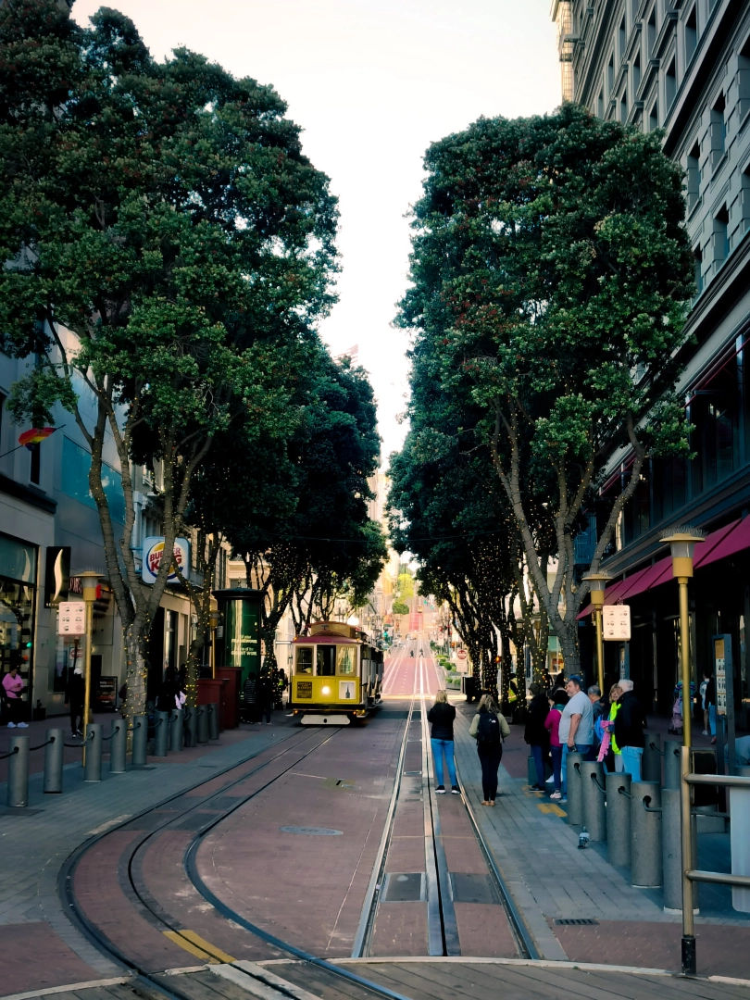

I personally don't have any materialistic wants apart from my skin care routine, but there is just one thing that I look forward to the most i.e. exploring new places.

When I started 2024 I promised myself as the infamous *new year resolution* that:
- I will travel a lot
- I will go to gym regularly
- I will progress in my career

It's not a linkedin post ofcourse but am glad that all 3 have been achieved to extents I didn't even imagine of but let's focus on travelling for now.

This is the story of how I travelled across the globe taking a total of 12 trips, once every month. I didn't plan this but stars aligned and half way through the year I knew I have to reach a perfect 12 and make it a **story of lifetime**.

TL;DR a brief experience about places I went to, experiences I had, who all tagged along with me if it wasn't a solo trip and probably if you wish to go any of the places hit me up for ideas.

## Mcleodganj, Himachal Pradesh

While everyone was hoping onto the wagon of new year travel I said let's wait a little to my friends **Pallavi** and **Kushal** with whom I began this journey. At the end of first week of January we planned our trip booked hostel and bus from Delhi.

I arrived in the city on Thursday went to meet **Shivansh** who had a plaster on during that time. Pallavi and Kushal came from varanasi for the trip

In the next four days we covered a lot of cafes, hiked around **Dharamkot**, watched [Kho Gaye Hum Kaha](https://www.youtube.com/watch?v=E1da2YxROaw) while wrapped in blanket, completed **Tirund trek** and camped overnight in shivering cold.

Me and pallavi as co-authors extensively covered this trip in one of earlier blogs [Passive Peaceful Mcleodganj | Backpacking Dream](https://blog.king-11.dev/posts/moody-mcleodganj/).

## Kodaikanal, Tamil Nadu

It was my friend **Mahesh**'s birthday another one of my photog buddy **Luv** was coming to bengaluru so we thought of planning a trip. So I packed my bags and headed for yet another trip.

I met a few friends in bengaluru and then midway of the week we left for kodaikanal. The stay was in **Zostel** which was filled with some more travel crazed people even a german person was there who played *bluff* with us.

The guys were able to grab **magic mushroom** there while I was cozy in the bed sleeping the night. We were mostly there for a change of place, much of the time was **workcation** where we used to stay in the cafe till evening and after completing the last meeting head out for exploration.

There were some really great cafes there just on the cliff, of course there was a trek more like natural staircases leading to **dolphin nose** and **cokkers walk** was a scenic sunset walk for us.

Me and mahesh left on friday to celebrate his birthday in bengaluru itself.

## Pokhara, Nepal

Pallavi came to meet me in December 2023 in Hyderabad so as per the pact after three months I had to come over there. So during the **Holi** holidays I went back to my alma mater IIT BHU.

I was getting bored there a little since I had explored everything but one trip that everyone had done was Pokhara so I wanted to go there. **Kushal** and **Pranjali** were meant to join us but couldn't due to some unavoidable reasons.

So after taking multiple different vehicles we reached pokhara and stayed at **Zostel** which was the most beautiful zostel ever, it has its own pond, cafe and a swing, girls love it for photoshoot.

**Pokhara lake** is very serene, the whole landscape looks like a very nice village and there are a lot of cafes around the lake. Renting a **scooty** we went around the city to **Peace Pagoda**, **Pumdikot Shiva Statue** and **Gupteshwor Mahadev Cave**.

The place was a little expensive definitely, also they were down valuing India Rupee in markets and we got caught by traffic police so after a funny/scary incident we lost half of our scooty deposit.

We decided to return a little early since we weren't feeling really great but definitely the place was very beautiful.

## Mumbai, Nasik & Shirdi (Maharashtra)

For my **US visa** appointment I had to go to Mumbai for biometric. My **parents** decided to get a hold of me and also reached there. After my visa appoinment which involved **rushing** to a different place then expected, not having my **phone** with me and **forgetting** to leave my fitness band (no electronics inside **VFS** office) at hostel it was done.

My parents took me from my hostel and we went to a hotel near Gateway, I attended a few meetings after which at sunset we went to the **Gateway of India**, roamed around **Marine drive** and had our dinner there itself.

In morning we left via cab for nashik where we went to **Trimbakeshwar Jyotirling Mandir**, saw **Anjeri hill** (where Lord Hanuman was born) and then headed to **Shirdi**.

We used to go Shirdi every year but after COVID it stopped finally we went again and I felt really great. In evening we took our flight to Jaipur.

## Austin & San Francisco (USA)

My open source project [Validating Lightning Signer](https://vls.tech) gave me an opportunity to speak at **bitcoin++ conference**. So after comforting my parents that I would be fine alone on kinda my first solo international trip I took the flight from New Delhi, used my lounge access at Zurich, ran to grab my connecting flight from Dallas and reached my **Airbnb** at Austin in night.

The people I knew over there were **Ken**, **Vincenzo** and **Stratospher** (only Indian). The conference left me with a little impostor syndrome that I still have to learn a lot as most of the things were going above my head.

I roamed around the city with my conference friends and solo as well while using [Uber Lime](https://www.uber.com/in/en/ride/scooters/) grabbed cool swags and taught my airbnb host how to use her [Trezor Hardware Wallet](https://trezor.io/).

After this I went to San Francisco for our team meetup where **Jack** and **devrandom** were also going to be there.

### San Francisco
I was in love with this city even without knowing that it was the tech hub somewhat like **Bengaluru of USA** but with better infrastructure, quality of life and good native citizens.

My airbnb host was a very old lady she invited me to her **party** which compared to our crazy Indian parties was more about hanging out, eating home made food, having some wine and talking with friends over kitchen counter.

The public transport was really good, everything used to close by **7/8pm**, walking around the city was fun **Ken** gave me a walking tour of the city from **union square**, riding cable car, **little italy, china town**, etc. also a hoodie so that am comfortable in the cold weather.

I used to commute to **oakland** everyday and work from their with Ken in his **co working space** where he got me a screen and keyboard which devrandom had left.

Our team met in a **sushi restaurant** where I couldn't grab a single sushi by chopsticks so they got me a fork.

I took a solo tour around the city went to **Pier 39** where I saw sea lions cracking out loud with noises. There was of course the **Ferry building**, I could also see the **Alcatraz Prison** which is where a lot of movies were shot. Then I went around shopping and visited parts of china town and union square. Purchased an **iphone** for Mahesh from the union square.

Next day my vls team did a walking meeting along piers and then ended at a famous pizza place in little italy, Tony's Pizza.

After this Ken took me to **Golden Gate Bridge** which I have seen in so many movies. He told by about its history as well and how Bay Bridge is actually bigger but this is famous.

## Seattle (USA)

Microsoft took all its freshers to USA for Aspire conference in seattle. Our planners **ankit** and **vishwas** from my team decided we can take a layover in dubai to explore it as well with us visa.

### Dubai (UAE)
We arrived in morning at Dubai, given we didn't get *dubai connect* it was total random selection. I was supposed to stay with **shriyanshi** who got dubai connect, but played safe instead of getting evicted from hotel by staying with others in a paid hotel nearby airport.

It was scorching heat literally felt like being thrown into a microwave. Even though it was evening but it still felt very hot but anyhow we left for **Mina Bazzar**.

We were hungry so got into a kebab place while ankit and bhavika left for purchasing **gold** and shriyanshi left for Dubai mall.

**Vishwas, Bhargava, Lony** and me were the lucky ones to suffer a scare of confusing **dear** with **deer** at the kebab place. We took evening **metro** for dubai mall it was filled, given we had an evening cruise I was trying to run everyone on time we just touched dubai mall and left for **cruise**, ran through roads and finally had a fair enough cruise experience.

At night we came to **Burj Khalifa** and **Dubai Mall** clicked pics, went to the best book store I had ever seen and then returned to our hotel to catch flight the next day for seattle.

### Seattle
We arrived in morning in seattle. We went to a mexican place to get some tacos, everybody explored uber lime, fighting with finding the right credit card and lost each other. I went to **pike street farmer's market** alone but it was mostly closed by 6pm as per USA standards.

In night we went to **china town** where I met an **angry black man** who decided it was rude of me to click photos behind his back. After roaming we came back vishwas was tired but I wanted food so went out and grabbed a sandwich.

Next day morning we went to the first ever **Starbucks Roastery Cafe** it was quite a rustic place. Then in afternoon we went to **Microsoft Redmond Campus** which is basically all of Redmond. I took the bus and met navya also during the ride. We had Azure Core Meetup there where head of Azure **Girish** was also there. The best part starbucks coffee machine with best **Chai Tea Latte** and alcoholic drinks in the office meetup.

We took the car to **Idlywood lake** as well which was nearby. Later shelly took over while returning and I was scared so as soon as she stopped the car I ran towards bus stop but the guys called me back.

Next day in evening after the conference we went around Seattle visited **Space Needle** and **Amazon Spheres**. The last day of conference there was a party hosted in **Museum of Pop Culture** and Microsoft got exclusive access to its employees in the Monorail.

We took a day trip to **Mount Rainier National Park** after losing a lot in navigation thanks to someone, we reached the snow point. Hiked around it a little, played in snow, trekked till top and then had our dinner in a cozy restaurant which took a lot of time so no tip. I drove on the way back to seattle it was scary and exciting at the same time driving on the mountains.

While everyone left for San Francisco I took a late checkout and went to roam around **Bainbridge Island** by taking the ferry ride. It was a very peaceful place filled with wholesome vibe. I also collected a few sea shells and then bid good bye to USA.

## Eastern Europe

Time for a good old relaxed family trip. After having troubles with getting **Schengen Visa** in Hyderabad due to absence of rental agreement but after 2 rounds to old city finally got it.

I departed from Hyderabad, reached Jaipur. Parents forcibly took me for shopping where we spent a lot, on the premise that I hardly buy clothing. Finally packed we left for New Delhi for our flight. **Anil chacha** had arranged a few Euros for us. My OneCard would also come handy as it has cheap forex fees.

We had Air India flight and the plane was shit, **Thomas Cook** was definitely saving money here but atleast food was good. We reached Vienna, they took us straight for dinner and then our hotel.

Next day we left for **Cesky Krumlov** which is in Czech Republic, lots of palaces around, river flowing through the town, made mom and dad try local cuisine which they liked and disliked to equal extents. At night we reached **Prague**.

In Prague this has been the highlight for me I got to transact **bitcoin** for czech crowns with a friend of friend. After this me and my brother were roaming around the **city night lights**. Prague is quite famous for its night life and clubs.

In morning they took us for a **brewery tour**, how people used to prefer beer over water in times of cholera. Me and my brother decided to try beer and papa also tagged with us first time in his life ever. Next up was city tour of **charles bridge**, **astronomical clock** and main castle.

Next day we were on the way to **Budapest** along the way we had a stop at **Bratislava, Slovakia** got a city tour of the city again interesting palaces, river view and landmarks. Eastern europe has quite a vivid history. Also how **Czechoslovakia** became two different countries.

At night we reached Budapest and this city has the most amazing views loved it. We roamed around a little after dinner and went back to the hotel.

We took a city tour of Budapest covering **Buda Castle**, **Chainsaw bridge**, taking a cruise in the river, visiting the **Hero square**. The next day they took us to porcelain factory super expensive stuff and then to **Tihany** the lavender town near **Lake Balaton** which was beautiful. We hiked around a little in tihany and had some amazing wood fired over pizza.

Final day **Vienna** city walking tour through all the castles, churches and landmark. This has to be the most royal city with so much history. Before our departure we went to **factory outlet** where papa got a fossil watch for quite lower prices. I would have taken an Airforce One but they only had women's there on sale.

## Rishikesh, Uttarakhand

It was my birthday month and after celebrating it in peace with my parents and grand parents going to a renowned temple it was time to travel as a long weekend was coming up. This time again it was **pallavi** tagging along with me for an advanced meditation program in **Ved Niketan Ashram** by **Art of Living**.

The course was taken by **Akhilesh Paramanu**, an IIT BHU Alumni also. On the first day me and pallavi took a walk along river Ganga crossing **Janki setu** and **Ram setu** doing a little shopping as well. There was a huge shiva statue, at **Parmarth Niketan**.

From next day we had to go in **complete silence**, no talking through hand or eye movements, not at all speaking and leaving all the worries in a drop box. It seemed natural to me mostly as I enjoy being with myself.

Those few days **eat, meditate**, help in some chores around the ashram and **sleep** seemed liked the best. Away from regular teams call and continuous hours on the screen. One day early morning we also went for a trek to **Bhootnath temple**.

The last day though I over exerted in an exercise and had pretty high fever my the night and pain throughout the body. I barely slept but made it through the night by drinking water and sweating. It seemed the **toxins** were finding a way out.

On the way back I also went to meet **Aashi**, my smallest sister to celebrate her first **Rakhshabandhan**.

I have been **blissful** ever since the course, more **happy** with myself, more **calm**, looking forward to new experiences and also got my first promotion at Microsoft right after the course :).

## Gokarna, Karnataka

I returned back to hyderabad in august end. Since the return I was planning where to go next most of my friends were busy and some of them ditched the last moment. Finally **Hari**, suggested me to just book the ticket for myself and see if anyone would join.

That's what I did and it lead to my first actual **solo trip**. I went to bengaluru to meet my friends primarily kushal going through a rough patch. From there I left for Gokarna only after we had made plans for my next trip.

Gokarna is a very quaint town cum village. I booked in a **hostel** got my **scooty** and started roaming around. The next day I took off and went to **Murudeshwar temple**, where I had lunch in the temple itself, didn't get to go to the top but still the Shiva Statue was magnificent.

On return I went to **Belakam Beach** which was completely empty not a single soul and I felt so connected with me there. I took on the trek to **Paradise beach** with another solo traveller who came back from half way as he was scared to trek through forest alone in evening.

Next day I went for the beach trek covering **Kuddle, Om** and **Half Moon** Beach. I called my mom and dad from the route and showed them the cliff leading into the sea, how thrilling for me and scary for them. **Shree Maha Ganpati** Temple, known for its relation with Ravana carrying shiva from kailash and being stopped midway. The temple has strict dress code so I had to buy a **lungi** from nearby.

Biding Adieu to a beautiful place I left for Bengaluru with plans to come back ofcourse.

## Goa

 On reaching bengaluru and before leaving for gokarna I made the boys agree for a trip to Goa. So this was my boys trip finally **me, kushal, anshu** and **vivek**.

First day we reached got the scooty from bus stand itself and drove off to our hotel. First stop was a cafe and then to **Chapora Fort** where we tried copying the famous "*Dil Chata hai*" Movie pose. After that we went to **Vagator Beach** where boys went for para sailing but I skipped as didn't find it that fun.

In evening we got to know about **friday night market** and it was really good. On the hilltop, there were so many cool stuff to buy I got myself a **traveller diary**, mummy a **ganja** infused amritdhara for headaches and one pedant for tanu shree of **hello kitty**. Other boys also bought a lot of stuff from there it was handmade and pretty unique.

Next day we went sunbathing on **Anjuna beach** although it was just laying on a beach chair under umbrella. After this was **Agoda fort** which was had some spectacular views of the sea and land. I turned on **Gangsta mode** with bandana, shorts and sunglasses, was liking it as it was different.

At night we went to **Tito's Lane** it was cool but crowded and didn't like the vibe a lot. Anshu wanted to go to **Thalassa** which was a little far but we drove their for our brother. While he was driving I was sitting with my back turned to anshu looking back and having fun. We waited a long time at Thalassa and finally got stag entry at midnight for 2k per person (not cover charge) crazy but DJ and crowd were great had fun who cares about money.

Last day we visited **Paperboat collective**, it was a place only for crazy rich indians but I got a canvas set for shruti as she likes painting. Later, we  went to the **coconut tree lane**, took photographs and then after collecting our stuff from hotel were on the way to catch our bus.

## Shoja, Himachal Pradesh

This time it was again my photography club friends (atul, abhinav and aditya) since I was in north and **mahesh** was also gonna pass by delhi we decided to head for Himachal Pradesh. **Luv** has been saying a lot about Shoja so we decided on it, booked our bus from delhi and **Zostel**.

Shoja was near the **Jalori Pass** where by accident happened two years ago. We were dropped by our bus at Aut from where we took a local cab to shoja. There we freshened up and were just focusing on work for the day, in evening we went hiking a little to find **Shoja Waterfall Trek,** which we didn't but I found myself little stuck in a dried out but slippery waterfall.

The next day till afternoon we all were working online from **Firgun Chapter Shoja**. Around 3pm we decided will head for **Raghupur Fort Trek** joining us were 3 female travellers from zostel which aditya connected with yesterday.

On the trek I decided am gonna **camp** the night and not travel back as mistake was made last time. Others were a little skeptical but anyhow we started trekking I went ahead as usual with me was **Pari**, who I came to know also works at Microsoft as Senior SWE. Somehow we took the wrong route had to climb random mountain at **90 degree** slope but reached the top finally.

The evening at camp we played **Mafia** with other people, had our delicious dinner, clicked super cool night shots mostly resembling dark knight and also the stars were so clearly visible like never before in my life.

The next morning was also nice, saw the sunrise and then we started hiking down and to everyone's surprise Mahesh completed his first full trek of **3km**, so proud of my boy. On reaching hostel we quickly emptied our dorm and instead boys decided to stay one more day while I had to leave for my parent's anniversary.

So till evening I stayed with boys covering my work which I missed due to trek. I joined Pari and her friends for travel down to aut we were really scared but these local drivers know their way around. Finally we reached to aut, still in the bus a little **PTSD** was hitting but I thanked god for making me reach safely back.

>A promise was made that I will stop drinking alcohol and consuming any kind of tobacco or weed or anything related to intoxication if god protected me from any mishap and he did.

## Pune, Maharashtra

I had plans to maybe take another solo trip to North East and see Christmas there with snow all around. But I after a long time connected with my long time friend **pranjali** and we made a pact that I will come to pune and she will come to Hyderabad (*TODO*).

I took flight from hyderabad, reached pune very early morning as it is a **air force airport**, pranjali before sleeping woke me up by calling for flight. I reached her home where uncle and aunty were awake she offered me some chai and biscuits after which I slept.

After I woke up, freshened and had lovely breakfast made by aunty me and pranjali booked our cab for **Pawana Lake**. We found a really good **cafe** there, spent some time around it, then this girl wanted to take a dip or basically get herself completely wet in waters, went for it. Later, we went to another spot where *locals* were trying to send us away saying its a private property but she won't budge finally after they left we had good time their.

In evening Pranjali taught me how to play **Lawn Tennis** with utmost patience and burning a little sweat is always fun. During night after our dinner we watched **Aristocats** a movie from 1990, 2D animation but overall a very wholesome story.

Next day we headed after waking up late to **Sinhagad Fort**. We took a full circle of the fort it was majestic and huge. There was a spot where non-stop wind was coming and I clicked a picture of her that received over **90k** views on pranjali's twitter. On the way back there was a lot of traffic so I slept (my super power) on her shoulder. We reached a little late, had dinner, watched **Eternal Sunshine of the Spotless Mind** loved every part of the movie.

It was Monday so not much travel I worked the whole day but I had my lawn tennis training session in evening. Also went roaming around the locality a little. In evening we played **cabo** me, pranjali and **pragya** (her sister). It was crazy fun primarily because me and pragya were winning and pranjali wasn't really into game yet xD. I taught pranjali **table tennis** later and uncle also joined us, he is a great player.

Today, I took the day off and we went into main pune city. We visited **Dagduseth Halwai Ganpati** the ganesha statue was so beautiful and it also had window darshan for easy access to devotees. Pranjali bought me a *Ganesha with Laptop*. Later we went to to **MG Road** for the world's best softy (*Pranjali's words*) at **Pasteur Ice Cream**. It was delicious and only thing I could eat after lunch as I had my fast today. We did a little window shopping and I got her cute bunny ears.

Now we ran for our booking at **Phoenix Mall** for **Mufasa**. We were going direct but aunty asked that we take pragya from home and then go, after which we encountered a lot of traffic and reached close to intermission. Somehow the story still made sense a beautiful story before the origins of "*Simba the lion king*". The **decorations** were really great, I had my christmas moment and pragya clicked really good photos of mine.

Last day of my vacation/trip we went to the infamous **Koregaon Park**. Just before entering we saw a Porsche store as well iykyk. The **Osho Garden** had a lot of plantations and a good place to relax. Later we headed to a nearby **Vietnamese Cafe** where I experimented with Matcha and *Oat Milk*, not a great combination. Finally while returning we visited **Crossword** so I can select a book for pranjali which she will enjoy.

Took my flight back but this trip was dear to me as I felt just like at home, aunty took care of me like her own child, pragya vibed with me a lot we have a lot of similar interest, uncle got me a really thoughtful gift before my next career progression (stay tuned on linkedin) and of course by dear friend who was kind enough to invite me, tag along everywhere and made me have such a great time.

## Wrap Up

This adventure/expedition of mine to achieve this interesting feat while working with a full time job was not easy but the fulfilment I had in each trip due to the place, company and experiences made it all worthwhile.

It definitely was exhausting not taking full time off and instead managing taking meetings from top of the Himalayas or near the sea side. But my team here at **Microsoft** was so supportive and my manager gave me **freedom** to pursue things as long as the work doesn't get hampered. I don't think if I would have been in any other company it would be possible.

I am not sure how much more I will travel will I ever go for a 12/12 again but am not stopping, there is so much more left to explore, visit and see through my 4 eyes :P. But for now I have a story.

>Traveling—it leaves you speechless, then turns you into a storyteller.
