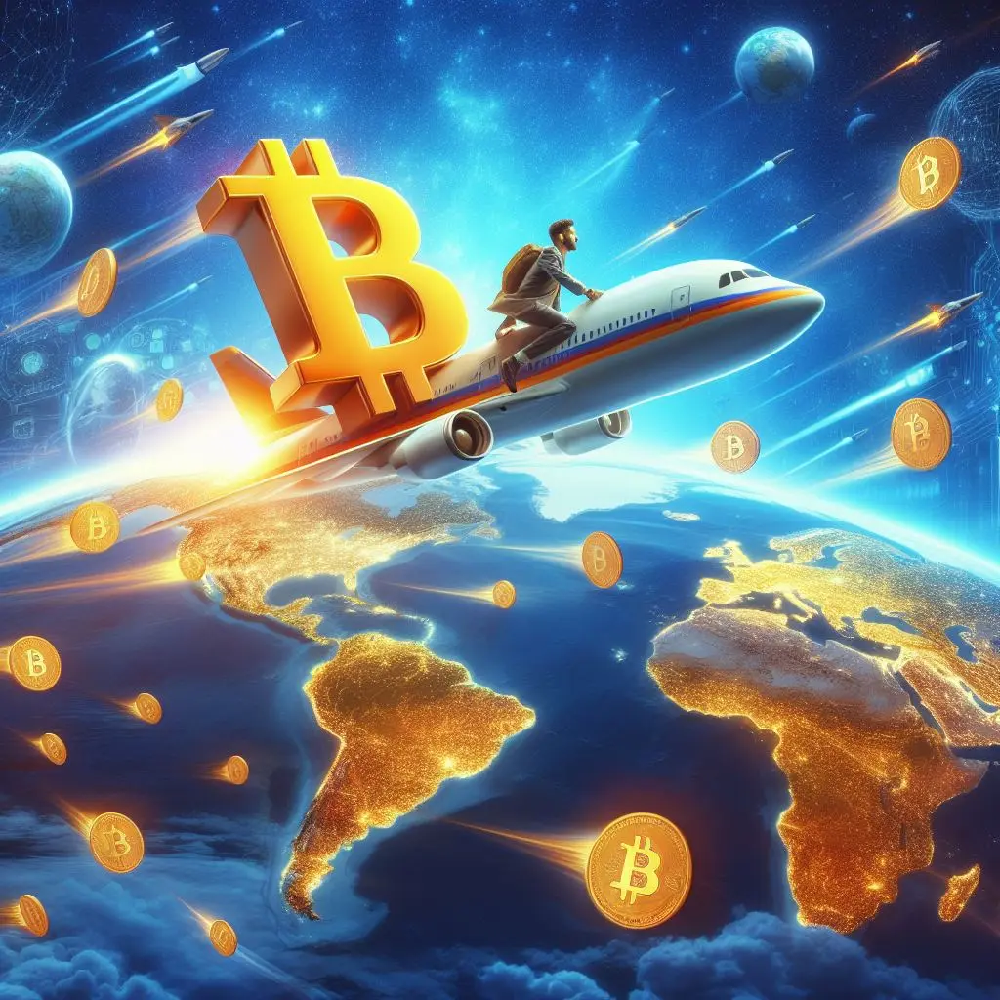
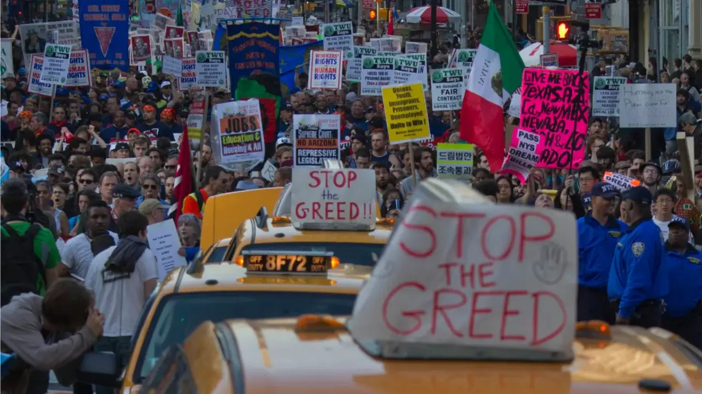
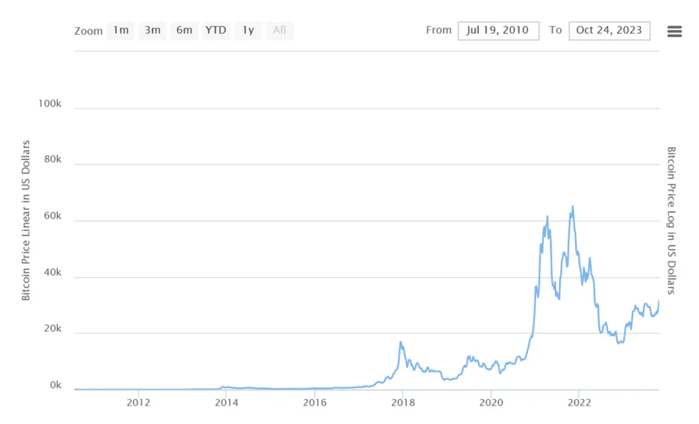
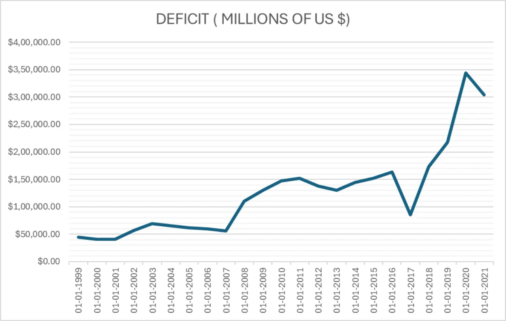
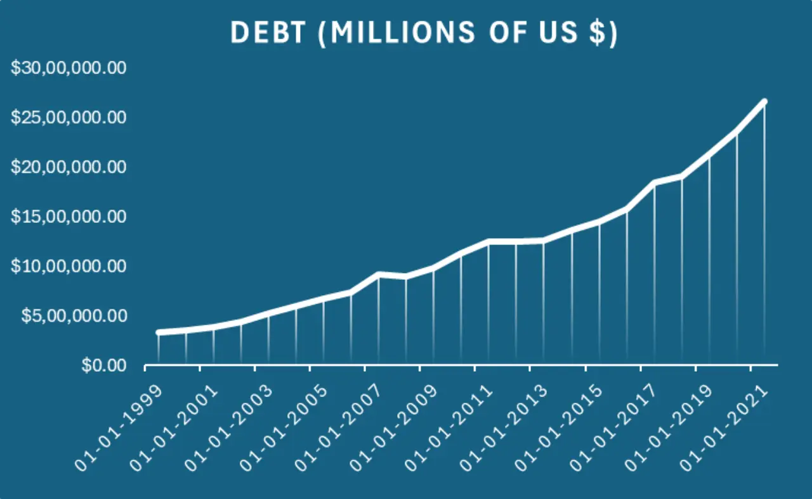
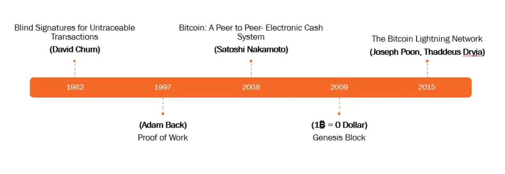

# Financial System

Bitcoin is a **financial system** created to serve a highly political intent, a **free** and **uncensored** network where all can participate with equal access. It is a mechanism of **organizing** people and computers to make one immutable, digital document.

## Bitcoin Offerings

- Bitcoin doesn’t keep track of the identities of the people (or machines) that use it making it **permissionless**.
- It doesn’t increase the supply of bitcoins to meet demand making it **deflationary** and **inviolate**.
- It doesn’t force itself on anyone making it **consensual**.
- It doesn’t exclude anyone from using it making it **inclusive**.

>It is well enough that people of the nation do not understand our banking and monetary system, for if they did, I believe there would be a revolution before tomorrow morning - **Henry Ford**

# ~~Alt~~ Shit Coins

Bitcoin is the OG crypto it's not like other **shitcoins**, that keep popping up everyday. Every f-king day these *wannabe* crypto enthusiasts create an alt coin (short for alternate coin) thinking it will boon someday...it won't.

While **blue-chip cryptocurrencies**, such as `Bitcoin` and `Ethereum`, have robust infrastructure and fundamentals to back them up, `shitcoins` rely on short-lived hype and FOMO (Fear Of Missing Out) to build up value. In March 2023, Ethereum co-founder **Vitalik Buterin** sold $700,000 worth of `shitcoins` that were airdropped to him, **crashing** the `shitcoins` price down as they are mostly operating on large investor money.

# Breaking Barriers

Bitcoin has no boundaries a person sitting in USA can easily and safely do transaction with person sitting in India without worrying about paying currency exchange fees, [foreign remittance](https://cleartax.in/s/tax-on-foreign-remittance), etc and going through hassle of multiple financial channels. It is one true global currency that doesn't divide people based on country but instead provides a simple, safe and secure mechanism to cater to all your transaction requirements.

# Primitive Institutions

I was just starting to write this article and my father told me about the [latest news](https://www.patrika.com/jodhpur-news/scam-worth-crores-of-rs-from-banks-started-from-jodhpur-1-in-custody-8600489/) where people defrauded banks in Jodhpur and `double spent` their actual funds due to a fault in their servers resulting in creation of money valuing around **850 crores** out of thin air.

**Double Spend** aka [Byzantine General's problem](https://www.bitpanda.com/academy/en/lessons/what-is-double-spending-and-why-is-it-such-a-problem/) was the first problem Bitcoin had to solve as a distributed finance system. In `2008`, it was done by [Satoshi Nakamoto](https://en.wikipedia.org/wiki/Satoshi_Nakamoto) using blockchain, still the supposedly *safe* and *secure* financial institution can't protect our money and suffer from problem which was solved a decade ago.

Current financial institution are here to **earn** from you and not cater to your needs. They won't stop badgering you until you **lock** in your money with them using multiple *Ponzi* schemes.

>Whatever money you don't hold isn't your money. - **My Dad**

When the day comes they start crashing like in **2009**, there is nothing that would be able to protect your money instead they take the route of **locking** your money from any kind of **withdrawal** to save their arses first. I highly recommend anyone to watch [The Big Short](https://www.youtube.com/watch?v=vgqG3ITMv1Q) to better understand how it all went down in 2009 due to **fraudulent** and **delusional** financial institution.

> Blackrock named **Jamie Dimon’s JPMorgan** as their Authorized Participant for their potential **Bitcoin ETF**. Jamie Dimon LITERALLY said earlier this month that the _"if I were the government I would [BAN Bitcoin](https://www.youtube.com/watch?v=ujWR6t69UP8)"_ because only criminals use it and JPMorgan says ETF optimism is overhyped. You see how two faced these bankers are?

# Negative Inflation

A salaried individual in today's world has to worry about thing like stocks, mutual funds, PPF, bonds, options, etc because we have to beat inflation and inflation is normal right your money loses power and value it holds over time, it's meant to happen

But let me ask, why is it normal though why shouldn't a 100 rupees note today hold the same value 10 years later?

>Economists have identified several possible causes for inflation from rising wages to increased aggregate demand to an **increase in the supply of money**.

The fools minting out the cash don't understand shit about the financial systems how would they most of them don't posses any form of official college education/degree. They keep increasing the supply of money as and when they deem fit which results in overall paper bill losing its power.

Bitcoin saves its owners from all these worries, given the limited supply which keeps decreasing every 4 years to half (Bitcoin Halving) making it a scarce resource. It will keep deflating (currently at **164% per annum**) at an exponential rate compared to any other asset like land, stocks, options, etc.

# Government of Goons

>Spend some time with Bitcoin. Learn it, challenge it, and use it. You can assume no government wants you adopting this system in any capacity, and for that reason alone it’s worth consideration by honest, moral, and industrious people - **Erik Voorhees**

Every form of government be it monarchical or democratic or communist want just one thing **control** because without control they aren't anything. Bitcoin is beyond their control:
- They can't control the transactions or even identify individuals involved in a transaction
- They can't measure the capital value you are holding in your bitcoin wallets
- They can't inflate bitcoin by minting more of it as they do with paper money
- They can't impose state embargos on bitcoin moving across the countries

All the above cited reasons are what makes bitcoin an ideal currency for medium of exchange from a user's perspective not governments.

>I had almost finished writing my article when I learned that **India's Financial Intelligence Unit (FIU)**, a branch of the Finance Ministry, had issued a [notice](https://pib.gov.in/PressReleaseIframePage.aspx?PRID=1991372) and blocked the domain of several bitcoin exchanges, making another attempt to undermine **bitcoin's supremacy**.

## Data Speaks

Let's consider two measuring tools which give us idea of how **poorly** our governments manage country finances, after all financial education needs education and most of our ~~il~~literate parliamentarians don't have any formal education.

**Fiscal Deficit:** A fiscal deficit is a shortfall in a government's income compared with its spending. A government that has a fiscal deficit is spending beyond its means. The government has to borrow money to meet its expenses. The government's debt increases over time as it continues to borrow.

**Fiscal Debt**: It is the total debt accumulated over years of deficit spending. It is the sum of all the fiscal deficits over the years. It is the total amount of money the government owes to its creditors.

Every Indian today is born with a debt of **Rs. 1,57,594.93** (debt per capita) all thanks to the wonderful schemes put in place by our governments to provide **freebies** instead of generating valuable assets in terms of people and infrastructure.

# Instant and Secure

I understand that you are not willing to wait a minimum of 10 minutes on chai point until your bitcoin transaction confirms. Neither would you be willing to send a large sum of money in some investment or purchase over the bitcoin network since it is public ledger visible to everyone.

Satoshi always knew this and in **2009** itself he proposed for creation of layer-2 networks over the main bitcoin network.

## Lightning Network
If Bitcoin is to be used for **everyday** payments the transaction speed must increase and transaction costs must decrease drastically. The **Lightning Network** (also referred to as Lightning, or LN) is a scalability solution built on top of Bitcoin that allows users to quickly send and receive BTC with virtually no fees.

Lightning makes Bitcoin a viable option it can be thought of as **Indian UPI** system for Bitcoin just **decentralized**. The Lightning network uses smart contracts (HTLCs) and payment channels between two parties.

| Network | Transactions (per second) |
| :--: | ---- |
| Bitcoin | 10 |
| VISA | 6000 |
| Lightning Network | 250n (n is number of channels, unlimited) |

**Note**: Lightning network can have as many channels as it wants so TPS has no limit or we can say *sky is the limit.*

## Liquid Network

The Liquid Network is a Bitcoin layer-2 solution enabling the fast, **confidential** settlement and issuance of digital assets, such as stablecoins, security tokens, and other financial instruments, on top of the Bitcoin timechain.

While it's not fully permissionless like Bitcoin, Liquid is fault-tolerant, censorship-resistant, and has [different trade-offs](https://blog.liquid.net/six-differences-between-liquid-and-lightning/) than other second layers like Lightning. Liquid’s high degree of privacy represents an important benefit for traders.

# Conclusion

Further read to get a in depth understanding of bitcoin:
- [The Bullish Case for Bitcoin | by Vijay Boyapati](https://vijayboyapati.medium.com/the-bullish-case-for-bitcoin-6ecc8bdecc1)
- [Why Bitcoin](https://whybitcoinbook.com/)
- [Bitcoin: A Peer-to-Peer Electronic Cash System](https://bitcoin.org/en/bitcoin-paper)
- [Money Creation and Society](https://www.youtube.com/watch?v=IkK0mLaEmU4)

Give bitcoin a try, if you have any queries am more than happy to help you out with them at [@1108King](https://twitter.com/1108King) but like any other investment it's a risk _"should you choose to accept it your mission is to explore bitcoin"_. Thanks for reading and have a great year ahead.

