I recently tried to move all my **DNS** records for web resources deployed over the internet to the unified network of `cloudflare` as they are just great at what they do with all the services and network protection.

I will walk through the setup `cloudflare` to use as [nameserver](#nameserver), DNS record management, and **SSL/TLS** setup. There is plenty more at `cloudflare` like [rate limiting](https://blog.king-11.dev/posts/rate-limiting/) as well.

Let's get this out of the way first Domain Name System (`DNS`) is a way to translate domain names like [blog.king-11.dev](https://blog.king-11.dev) to its IP Address.
```sh
host blog.king-11.dev
blog.king-11.dev has address 172.67.164.94
blog.king-11.dev has address 104.21.66.209
blog.king-11.dev has IPv6 address 2606:4700:3033::6815:42d1
blog.king-11.dev has IPv6 address 2606:4700:3032::ac43:a45e
```

The resources I moved from multiple different providers included:
- Custom Domain
- Static `Github` Pages Website
- Dynamic `NextJS` Website
- Home Server Network Tunnel

Let's dive into how my late night network shenanigans went.

## Custom Domain
I had a great time just using [github.io](github.io), [vercel.app](vercel.app) and [netlify.app](netlify.app). These service providers are amazing and offer you a lot for free. But there were primarily two reason for my switch:
- I wanted to setup a [cloudflare tunnel](#cloudflare-tunnel) for my `jellyfin` server at flat so that I can binge watch my series and movies from anywhere in the world
- Having everything under a single umbrella helps in developing the brand as people remember it easily so why not?

### Purchasing Domain
So after asking people what top level domain (`TLD`) should I buy and thinking a little about getting free ones. I unloaded my pockets and got myself **[king-11.dev](king-11.dev)** from **[Namecheap](namecheap.com)**.

The only issue was they didn't provide `INR` payment options just like `cloudflare` so I had to use my **[OneCard](https://www.getonecard.app/)** as that provides a good **forex** rate of **1%** only.


I could have bought the domain from `cloudflare` too they are the most transparent in terms of domain registration as they only ask for the registration charges and nothing else. But their `paypal` integration wasn't working for me and `namecheap` was cheaper so went with it.

### Nameserver
**Nameserver** is the server which contain `DNS` records for your domain. Think of it like a phonebook which contains your addresses, there can be many phonebooks but only one some will contain your details.


To manage my custom domain on cloudflare I had to update my nameservers on namecheap and point them to the ones that cloudflare provided me.

To verify that nameserver is set properly we can use `dig` command
```bash
dig king-11.dev NS +short
mark.ns.cloudflare.com.
ollie.ns.cloudflare.com.
```

Now the domain is in hands of `cloudflare` it can now easily create new DNS records for my domain name.

## Security Settings
We can do additional setup to ensure that the content is transferred securely between all involved entities. To do this will enable full SSL (Secure Socket Layer)/TLS (Transport Layer Security). Under websites -> king-11.dev -> SSL/TLS, we would set my encryption mode to `Full`.

```mermaid
graph LR
	B(Browser) -->|🔒| C(Cloudflare)
	C -->|🔒| O(Origin Server)
```



Furthermore, I can upgrade all the `HTTP` connection to `HTTPS` which returns content to user over a secure transport channel.
1. Under the SSL/TLS section, there is option of *Edge Certificates*
2. Under Edge Certificates, we can enable "*Always Use HTTPS"*


## Github Pages
I have been using github pages to deploy my static sites which included my [blog](github.com/king-11/blog) repository. It uses a **[github action](https://github.com/king-11/blog/blob/main/.github/workflows/hugo.yaml#L36)** to build and then publish my **[hugo](https://gohugo.io/)** based site onto github pages.

The change I needed to make here was
1. Add the custom domain in Settings -> Pages section.
2. Create DNS entry in cloudflare to point [blog.king-11.dev](blog.king-11.dev) towards a github server.

But I don't know the server neither does cloudflare's nameserver and given I am no more using [king-11.github.io/blog](king-11.github.io/blog) that entry would just redirect to my custom domain. So who will find me the ip address for my site?

### CNAME Entry
Given github is the only one aware about the IP Address of my server, cloudflare needs to add a mapping such that dns resolution for my subdomain is offloaded to github.

This is exactly what CNAME records provide a DNS level redirection, they map one domain to another domain where both can be handled by different nameservers.


So in the above case when users asks cloudflare for blog site it redirects user to github which given the custom domain configuration settings know which server this domain points to and can provide user the result i.e. an A Name Record (domain -> IP).

To see this in line action we can use the command
```bash
dig blog.king-11.dev +trace
```

### Mixed Content Bug
After all this process it started to happen that the cover of my blogs wasn't visible anymore. Checking the console of browser the issue was that

>Mixed Content: The page at 'https://blog.king-11.dev/posts/memory-management/' was loaded over HTTPS, but requested an insecure image 'http://blog.king-11.dev/posts/memory-management/cover_hu3f9b19c18b96efe8ccfa749888a579de_415626_720x0_resize_q75_h2_box_2.webp'. This request has been blocked; the content must be served over HTTPS.

So browsers don't allow accessing any HTTP (insecure) resource from an HTTPS (secure) page. But why was it using `http`?

I tried setting `cloudflare` to redirect `http` to `https` itself but browser was already blocking any `http` connection before even going out of the browser. I checked the generated html of my blog page to find the image component as
```html

```

So, the `src` tag is correct but image is loaded using `srcset`  (due to precedence) whose urls are prefixed with `http`. Now I updated my `baseURL` in hugo [config](https://github.com/king-11/blog/blob/main/config.yml#L1) file but still nothing was happening generated html was still using `http` only.

So I checked further `github` without information that SSL/TLS is enabled on my system was passing `http://blog.king-11.dev` to my github action which wasn't using `baseURL` set in `config` file. Finally, it made sense leading to a final commit with the following diff
```diff
	 run: |
	   hugo \
		 --gc \
-        --minify \
-        --baseURL "${{ steps.pages.outputs.base_url }}/"
+        --minify
   - name: Upload artifact
```

## Vercel Redirection
After going through github vercel setup was a breeze. Again given vercel deploys my site it has the *A Name Record* for it. So on cloudflare I just need to add a CNAME record pointing my root to vercel's cname domain and rest vercel handles on its own.

Two key things useful for vercel is:
- Set SSL/TLS encryption to Full mode initially it is flexible, which can lead to [ERR_TOO_MANY_REDIRECTS](https://vercel.com/guides/resolve-err-too-many-redirects-when-using-cloudflare-proxy-with-vercel)
- Enabling `Always Use HTTPS` allows ACME protocol used to validate the domain ownership to [bypass restrictions](https://vercel.com/docs/integrations/external-platforms/cloudflare#troubleshooting) and use `http`.

What came in handy here is vercel has a great documentation for bugs, troubleshooting and setup 🎉.

## Cloudflare Tunnel
So this all started from cloudflare tunnels. I have added details in my post [The Hacker Way of Living](https://blog.king-11.dev/posts/living-hacker/#self-hosting) about how I use self hosting to keep a personal library of movies and series, downloaded using torrent and hosted on my raspberry pi 4 using [jellyfin](https://jellyfin.org/) media server.

To access it [umbrel](https://umbrel.com/) provides **tor** based access which is very slow so I needed a faster solution. There was [Tailscale VPN](https://tailscale.com/) which wasn't working so the other option was [cloudflare tunnel](https://www.cloudflare.com/en-in/products/tunnel/).

```mermaid
graph LR
	B((Browser)) -->|jellyfin.king-11.dev| C[(Cloudflare)]
	O[(Origin Server)] --- D[cloudflared]
	D --> C
	M((👨‍💻)) --x D
```



So while there is a connection between `cloudflare` and `cloudflared` (d is for daemon process) on my raspberry pi, no other user can access it. I can then use `cloudflare` to serve it on a custom domain which I purchased.

We can go on our dashboard, Zero Trust -> Networks -> Tunnels to create a new tunnel. Now to expose it or even multiple other endpoints we need to add our public ip and what it internally maps to on the origin server.

## Conclusion
So the idea was for me to easily access my jellyfin from anywhere in the world while my raspberry pi 4 easily sits at my flat. Sadly, my flatmate unplugged it and forgot to plug it back.


Screams!, first of all you never unplug a server without properly shutting it down it will lead to data corruption. And secondly the server always stays plugged in. I need to set some new ~~flat~~ rules and setup warnings signs. Alexa play "*new rules*" because I don't have tickets to go and see dua lipa 😭.

That was all for this time, it was quite some learning about **networks** that my computer science course didn't even care to touch. I hope when you try to setup your own custom domain or self host things this blog would come handy. Thanks for reading see you next time after my next trip :P.


