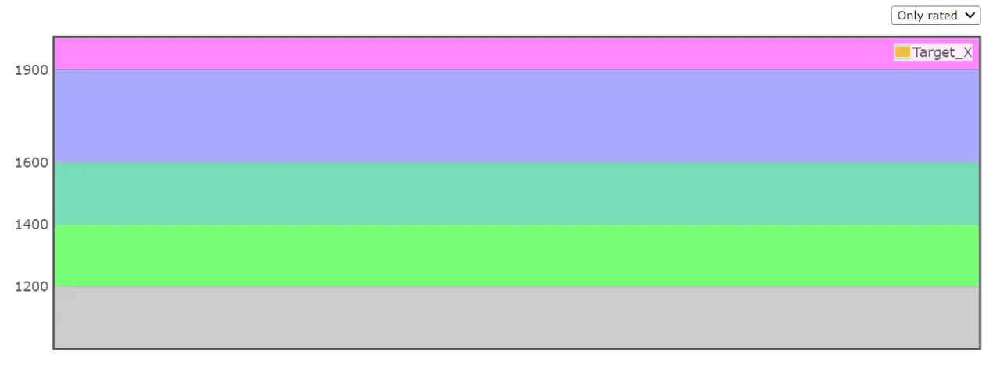
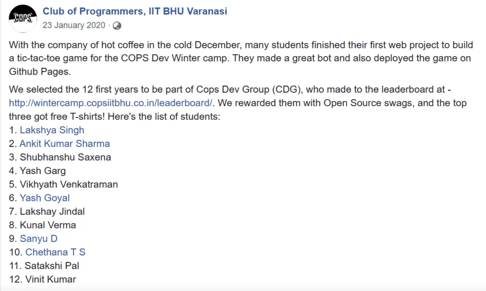
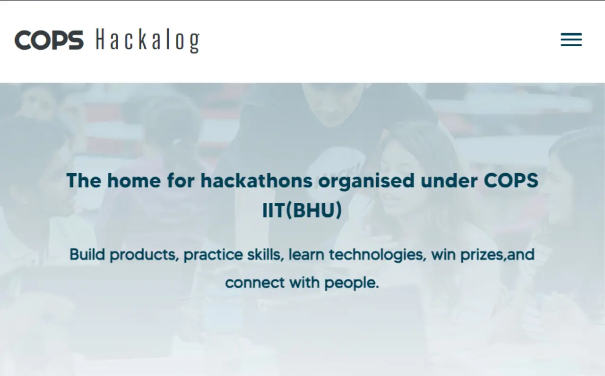
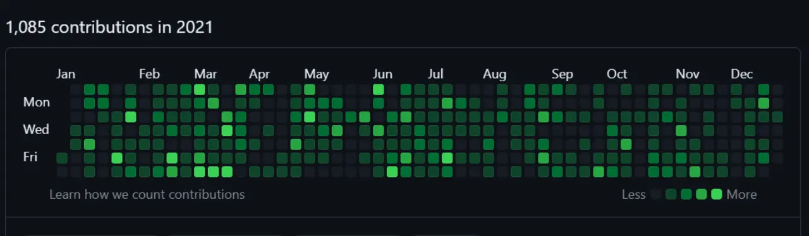

>Competition happens at the bottom. People at top are collaborating.

I read these words on Ravi's status and immediately it hit me as something I have tried to pursue since my very first month in college. Collaboration has been a key factor in my overall mental well being aka happiness throughout my career and overall life advancement.

## Enough with Competition

After going through 3 years of JEE coaching and having participated/succeeding in about all of the competitive exams including **IJSO, RMO, KVPY, IChO, and JEE Advanced**, I decided to put my foot down on competing.

I wanted to move away from being a **loner** pursuing achievements alone and instead tread on the path of **teamwork, collective effort, collaboration** and learning from as many people as I can.

## Zero Contest

~~I hope not but~~ Probably am the only person in my entire batch who never participated in a single short duration competitive programming contest. Yes you heard it right *not even one* because that's what I decided in my first year.

I don't want to be **ranked or rated**, it's not fair why should a single competition rate me when I have already pursued enough excellence throughout 10-12th standard.

My lack of contest participation shouldn't be confused as I never did DSA, its all visible on my [Github](https://github.com/king-11/Competitive-Programming)  as well as my [Advent of Code](https://github.com/king-11/AdventOfCode) journey over the years. I did DSA because:
- I love computer science and it is an integral part of
- I enjoyed learning about algorithms that make tedious computation easier
- I am a JEE kid so yes I enjoyed problem solving

## Where is collaboration?

In my initial days at college I found a few places where collaboration was the only thing that existed and there was no as such competition between involved people.

This consisted of **fest works** and **clubs** primarily. For fest I got involved in `FMC Weekend` Publicity Team and for the club part since I had a new **DSLR** at home along with new found interest for travelling after going to **Europe Trip** and multiple others I chose `The Photography Club IIT BHU`.

I also participated in `Aagman` under `Masquerades` and `IMC` but since I was so bad at acting and singing I didn't continue. But definitely the warm welcome you receive and sheer amount of efforts everyone puts to showcase the best **team effort** is amazing which I got to see first hand.

## Software Development

As I was looking for places to collaborate with people I wanted to hone my technical skills. I ended up in COPS's "*Intro to Open-source Hacktoberfest*" workshop. I was able understand half of it but free t shirts 🎽 was the reason I used by git skills from [CS50](https://pll.harvard.edu/course/cs50-introduction-computer-science). Then there was [Google Summer of Code](https://king-11.github.io/blog/posts/gsoc/) one which I didn't give much attention because how can a first year clear it right? ~~Well they did~~ .

Anyhow in winter break I focused on honing by technical skills with COPS's winter camp made a simple tic tac toe responsive web page ended up being the highest scorer in this task, Finally joined `COPS (Club of Programmers)`.

### Hackathon

I got my first hit of collaboration in Hackout, a hackathon organized by [Headout](https://www.headout.com/) under [Technex](https://technex.co.in) 2020 some of us (*me, shubhanshu, yash goyal and sanyu*) who recently joined `Software Development Group (SDG)` of `COPS` decided to team up and build something.  While I was dabbling with frontend using [Bootstrap Studio](https://bootstrap.io), Yash and Shubhanshu were learning Django in a span of **36 hours** and Sanyu was creating beautiful UI mocks. We did present something hacky after burning the midnight oil while some other fresher teams just gave up and stood **5th.**

### SDG Projects

During the COVID time many others joined [SDG](https://sdg.copsiitbhu.co.in) and we started creating multiple projects hackathon sites, internal sdg portfolio, technex website, discord and telegram bots, insti apps, etc. All this was full of learning and collaboration amongst people.

### Capture the Flag

It was an initial phase of COPS `Cybersec` and I was one of the first few selected but my primary interest was in Software so I left it for `SDG`. Even though I left as I couldn't manage time between both I always enjoyed the whole team coming together and trying to solve problem statements. We used to build on **each other's progress** and fight through `CTFs` together as **underdogs**.

## Open Source

Well this would need a separate blog altogether which I will someday write but my experience with [Google Summer of Code](https://king-11.github.io/blog/posts/gsoc-report/), [LFX Mentorship](https://king-11.github.io/blog/posts/lfx-report/) and [Summer of Bitcoin](https://www.linkedin.com/posts/lakshyasingh11_technology-people-security-activity-7063354741304549376-JF8O?utm_source=share&utm_medium=member_desktop) made it clear to me that I would never stop **contributing** and being **part** of open source communities. The shear amount of **growth, collaboration, advancement** and **impact** that open source has for an individual as well as on the whole human race is just immeasurable.

## Conclusion

I enjoy being competitive in a fun manner like **sports**, team bonding events, hackathons etc but certainly not in a manner that it can be used to rate me against other individuals. **People** are the key for me the more the merrier ~~to a certain extent~~, the **togetherness** in team events where you win together and you lose together the **support** system is just amazing.

All my past experiences have lead me to places like *open-source, microsoft, sdg, photog,* etc. where collaboration is the key for growth and fun :P.
