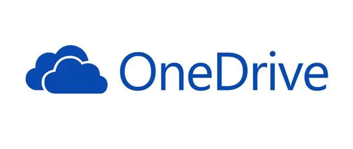

# Gold Plated Products

Gold Plated Products is what am calling products/services that get offered as free or for unlimited usage to get numerous people onboarded on it. After a while either they will add a paywall for complete service or some premium features which were previously free are now only available if you pay.

The issue begins when there is a lack of information provided to users of when the paywall or premium offering will become active. The Product Managers just wake one day and decide to choose violence, boom the paywall goes live.

Now user has two options ~~both are miserable~~:
- Going through the painful process of deboarding from the service through procedures which are never well documented.
- Start paying for the service if it suits your needs.

## Google Mail

The original pitch for Gmail was that you wouldn’t have to worry about deleting messages. Instead, you could just archive old emails and find them later by searching.

But in 2013, [Google altered the deal](https://drive.googleblog.com/2013/05/bringing-it-all-together-15-gb-now.html), creating a single 15 GB storage pool that covered all of its services, including Gmail and Google Drive. Its free storage limit hasn’t changed since then, and in recent years Gmail users have been [feeling the squeeze to become paid users](https://www.bloomberg.com/news/articles/2019-10-22/gmail-hooked-us-on-free-storage-now-google-is-making-us-pay).

## Google Photos

When Google Photos launched in 2015 with the promise of free, unlimited photo storage, the pitch was that you’d never have again to worry about photo management. Because of that promise, Google Photos quickly became one of the company’s most popular services, [hitting one billion users last year](https://www.fastcompany.com/90380618/how-google-photos-joined-the-billion-user-club).

But soon enough, Google had a different message for those users who flocked to the service: *"Time to pay the piper."*

After using up Google’s 15 GB of free storage, you have to pay for a Google One storage plan starting at Rs. 1,300/year for 100GB.

>The product is ad-free, and Google has pledged not to mine users’ photo data for targeted advertising purposes.

Let's see how long this lasts

## Google Drive

Google offered educational institution unlimited google drive space every student in institution fully made use of this as the best years of teenage life does require some space iykyk.

In 2022 they went back on the unlimited storage promise and limited it to 100TB for all the educational institutions. The response they were hoping was for institution to buy more storage but well the administration of most Indian Educational Institution haven't embraced the need of cloud so they didn't buy the subscription and are continuing with 100TB only.

Now a student with let's say around 100GB of video games/movies/photos/videos is now limited to around 20GB (100\*1024/5000) ~~and 5GB for alums~~ so they have to move 80GB.

One way is to download everything and then delete other is to copy (not move) it with ease to some another Google Drive. I have tried both and the files you get after download are utter rubbish to parse whereas the internal transfer is made very smooth.

But still you have to delete from original place in both scenarios but if most of your storage is due to Google Photos which was in my case you can't bulk delete because __*Google Engineers forgot to add option to delete all photos*__.

It's a typical example of ***vendor lock in*** 🔐.

So yeah basic quota is 15GB you need 80GB, *"Time to pay the piper."*

### One Drive

Microsoft also moved away from unlimited OneDrive storage given to educational institution to make them onboard onto the Sharepoint & Teams platform during pandemic. The reason they cited is as below:

>Today, most schools (99.96%) are well below their storage allotment. With new tools, all schools can better manage their information and set thoughtful policies for data governance. Some of the benefits we expect to see include helping schools reduce some of the security risks associated with legacy storage and data sprawl, a top concern for most chief risk officers, while also benefiting our shared environmental footprint.

Hoping the my institution falls under the 99.96 category because I moved multiple things from GDrive to OneDrive. But with OneDrive we at least won't have the trouble of deleting backed up photos as its a folder in your OneDrive which you can delete. So Microsoft at least allows you to deboard unlike Google.

## YouTube Music

One of the most recent services released by Google. It's a very nice service if you have a student ID you get 1 month free, but you have to start auto pay. I tried it, loved the recommendations and while crusing at 170km/hr on Delhi-Vadodra-Mumbai expressway it added even more fun to the journey where even my Mom and Dad started jamming.

It's been two days since my subscription expired given that I loved it I was planning to get a family subscription (179/month) since it's cheaper than individual subscription (79/month) if you have a pseudo family of friends also I wanted mom and dad to enjoy it but.....

For these two days they haven't stopped with the ads before every song you need to waste time on two ads of 5 seconds. Moreover you don't even have the option to keep music running in the background for scenarios like driving.

Least to say I have been miserable for the past two days and decided not to succumb to this unwanted pressure of subscription hell.

### Google Podcast

A very simple un-monetized service to listen to any podcast is being added to the long list of [killed by Google](https://killedbygoogle.com/).

They are moving podcasts to YouTube music where they can bully us into getting premium.

A finding from reddit:

>Got an email today that YouTube Premium Family is going up to $32.99 a month. I was paying $17.99. This and the adblocker crackdown is bloody outrageous. Good luck with the ads kids.

## Spotify Music

We all user experience and sound quality that Spotify used to give is unmatched from any other music service. When they started with year in review thing every other organization followed it even Paytm. But now instead of making others follow it they are following Google in making its free users feel miserable. Probably because Youtube Music was snatching away its revenue.

Really I mean the restrictions are quite innovative and absurd:
- prevent manual song selection from a playlist
- disable option to rewind, scrub, or repeat songs.

# What's wrong here?

I got to hear this word for the first time from Archit, `user empathy` that's what these product based companies have started missing out on. Why do you follow the policy of **lure and capture** through vendor lock in instead of making it clear from the start the cost of your service and attached perils of not having using a paid plan.

By giving free users a miserable experience you either end up in two places:
- Get more paid users
- Lose users due to the absolute lack of ethics.

# Conclusion

While there is no way to justify this but still let's understand why it is happening. We already give companies enough data for it earn through it but as ad growth gets tougher, many of them are seeing subscriptions as a big part of their future.

Most of the tax paying + general category + male suffer enough at the hands of the system holding the rant for some other time. So, to tackle this I enjoy being hackish and opportunistic as Bhavya (my mentor) defined this behaviour of mine.

*__"Bhai mai nah sehta"__*

To learn more about on dodging the need for all these subscriptions stay tuned on my blog: [The Backpacking Dream](https://king-11.github.io/blog/)
