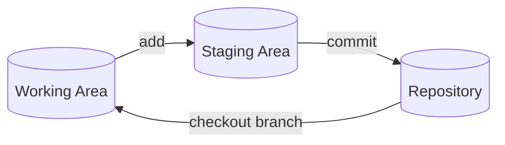
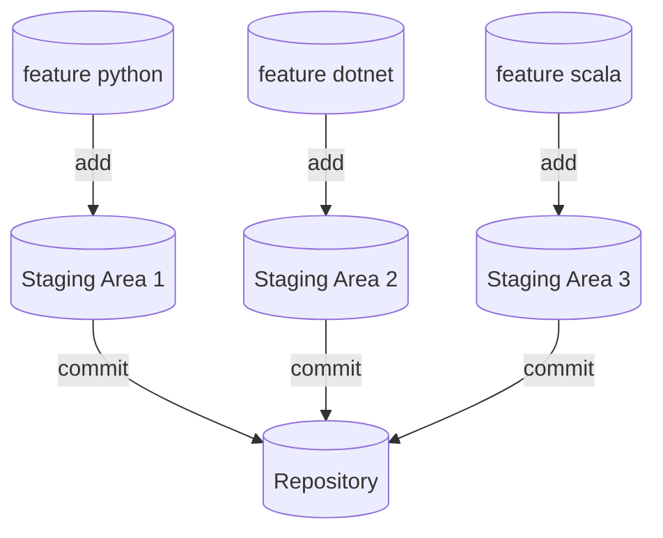

When you are working in a large code base comprising of **multiple** micro services maybe in a single repository your work would require you to make progress on multiple **features** simultaneously.

There comes in a lot of context switching which in `git` terminology means multiple **branches**. The flow can become *cumbersome* when you keep `stashing` and `checking` out. Let's see how that looks like.

## What is the problem?

Let's say I am working on a long term new feature in my freshly checked out branch `lakshyasingh/feature-python`. Now I made some progress on the feature and its not yet fully ready some changes are still present in the working tree and not yet committed.
```bash
git add detection_model.py
git commit -m "detection model new algorithm"
```

Now I am bored of working on this `python` feature and its gonna take some more time, meanwhile I can make progress on another important feature for `dotnet` which is in `lakshyasingh/feature-dotnet`.

So to switch to that branch and to not lose uncommitted changes present in python feature I will stash and then checkout.
```bash
# stash the uncommitted changes
git stash --include-untracked -m "feature python stash"
git checkout lakshyasingh/feature-dotnet
```

Given it also an unsaid responsibility to review pull request created by other contributors.


I move onto that task and checkout to branch created by them
```bash
# stash the uncommitted changes
git stash --include-untracked -m "feature dotnet stash"
git checkout bhavyakala/feature-scala
```

Now you see what the problem here is my git stash starts to look like my commit history
```bash
git stash list
stash@{0}: On lakshyasingh/feature-python: feature python stash
stash@{1}: On lakshyasingh/feature-dotnet: feature dotnet stash
stash@{2}: On lakshyasingh/java-coverage
```

Moreover there is an issue as the flow of things break as you `stash` and `checkout`. Your working tree might be in a state of disarray (with new, moved, and removed files, and other bits and pieces strewn around) that you didn’t wish to risk disturbing.


## Isolated Working Areas
Git works in three areas:
- Working Area
- Staging Area
- Repository

When we `stash` changes we are cleaning up the `working area`. Moving to a different `branch` switches the `repository` to a different `working area`.


You might think that **cloning** your repository into *multiple folder* is a solution but its a bad one as:
- The data will **duplicated** for the git repository.
- They won't **share** any new updates that you make in them locally.
- You will have to perform operations like `fetch` and `pull` on both the clones separately.

There exists only one working area at any point but if we had *multiple working areas* we wouldn't need to clear up one to use other. Indeed, a git repository can support multiple working trees, allowing you to check out more than one branch at a time using `git worktree`.


## Git WorkTree
So using `git worktree` we can work on multiple branches at the same time. We can even think of it as "multi checkout \<branch1\> \<branch2\>"

So let's use git worktree for the above scenario how will that help us. First of all will create 3 new empty folders to hold the dirty changes for each work tree.
```
projects
├── project1-python
├── project1-review
├── project1-dotnet
└── project1
```

Our repository is currently cloned in `project1` directory. We will create a new worktree for all python related work and store it `project1-python` directory and create a new branch `lakshyasingh/feature-python`
```bash
cd project1
git worktree add -b lakshyasingh/feature-python ../project1-python main
```

Similarly we will create different work tree for `dotnet` and `review` purposes.
```bash
git worktree add -b lakshyasingh/feature-dotnet ../project1-dotnet main
# checkout to already existing branch in remote repository
git worktree add ../project1-review bhavyakala/feature-scala
```

Our main branch will remain checked in `project1` directory.

Now the task of context switching is as easy as changing folders and your uncommitted changes will still be present in each isolated worktree.

### Caveats
You can go into any of the created worktree folders and run all the supported `git` commands there to modify the repository. All the common things `remote`, `stash`, `branch`, etc. are connected even though in different folder.

The most important thing to remember when working with worktrees is that
>You can only checkout a branch into one worktree at a time.

In case you delete the folder associated with any of the worktree the data present there will be lost along with metadata details. A better way to handle worktree deletion while keeping you uncommitted changes would be as below
```bash
# if there is uncommitted changes stash them
git stash --include-untracked -m "<message>"
cd ../project1
git worktree remove ../project1-dotnet
```

If you don't care about the uncommitted changes in working area you can go all *YOLO* with `-f` flag.

In case you move around the linked worktree's by renaming the folder or changing its location the worktree reference will be lost.
```bash
mv project1-python project1-py

git worktree list
/home/king11/projects/project1            8b526a3 [main]
/home/king11/projects/project1-python     8b526a3 [feature-python] prunable
/home/king11/projects/project1-dotnet     8b526a3 [feature-dotnet]
```

The worktree is listed as `prunable` and `git` will clear it soon all the metadata present there. To fix this we can run `repair` to bring back the association
```bash
cd proejct1
git worktree repair ../project1-py
```

We can provide multiple paths in case many worktrees were moved together.

## Conclusion
Git worktree is a good utility tool to use when you have a large code base and team at your hand to collaborate with. There is no denying that `stashing` and `checkout` is faster but after the initial process of setting up worktrees is done its a smooth ride to sail along.

Also given git is one of my most favourite topics there is so much more to explore and learn, a true marvel of a **distributed system** powering most of the large scale systems today.


Anyhow my craze for git will keep going and so will the blogs, thanks for reading and if you have any review do reach me out on [@1108King](https://x.com/1108King) and maybe share the blog with your team 😉
