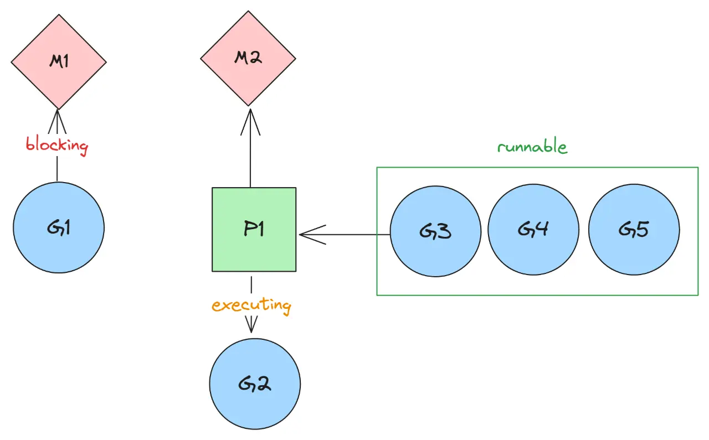

A **goroutine** is a lightweight thread of execution managed by the *Go runtime*. To start a new goroutine we use the `go` keyword

```go
go f(x, y, z)
```

The *evaluation* of `f`, `x`, `y`, and `z` happens in the current `goroutine` and the *execution* of `f` happens in the new goroutine.

Goroutines run in the same address space, so access to shared memory must be synchronized. The `sync` package provides useful primitives, although you won't need them much in Go as there are other primitives like `channels`.

# When to use?
With `goroutine`, we can make asynchronous network IO and continue the program without the need to wait for the response to come back. Obviously, network IO is just one of the many examples. We can do parallel processing like a mini map reduce and fully utilize each CPU core we have on our modern days machine.

# Architecture
`goroutine` is not a `os/kernel` thread. It is an abstraction of a thread, more commonly known as application thread. It is Go runtime's job to manage how many OS threads to create and how goroutines are mapped to and executed on OS threads.

## Go Runtime Components
There are three main components involved in the execution of a goroutine i.e. the goroutine, an abstract logical processor and the machine.


- **Goroutine**: Each goroutine is described by a [G](https://github.com/golang/go/blob/master/src/runtime/runtime2.go#L339) struct. The struct keeps track of various runtime information, like stack trace and status.
- **Logical Processor**: P stands for Logical Processor. It's an abstract resource or context. We usually call **P** a context that is mapped to a **M** to run **G**s.
- **Machine**: The struct [M](https://github.com/golang/go/blob/master/src/runtime/runtime2.go#L404) stands for machine, which maps to an OS thread which can execute a **G** or goroutine.

## Entity Interaction
When a Go program starts, it is given a logical processor **P** for every virtual core. Every **P** is assigned an OS thread **M**. Every Go program is also given an initial **G** which is the path of execution for a Go program. OS threads are context-switched on and off a core, goroutines are context-switched on and off a **M**.



**P** is responsible for scheduling all *runnable* **G**s on **M**. If and when an executing **G** makes a blocking call, **P** moves onto a different **M** while **G** blocks the current **M**.

### Controlling Parallelism
We can set the maximum number of goroutines executing in parallel by limiting the number of P.

```go
package main

import (
"fmt"
"runtime"
)

func main() {
  fmt.Println(runtime.GOMAXPROCS(1))
}
```

This limits the maximum number of **P** to 1 but that won't limit the program to not spawn more than 1 **M** (OS Threads) in case of blocking call as stated above.

# Thread Synchronization
>Don't communicate by sharing memory; share memory by communicating

This is the moto which go lang has popularized, in which we don't give threads access to shared memory but instead share messages/data by communicating with each other.

## Channels
Channels are a typed thread safe conduit through which you can send and receive values with the channel operator, `<-`.
```go
ch <- v    // Send v to channel ch.
v := <-ch  // Receive from ch, and
           // assign value to v.
```
(The data flows in the direction of the arrow.)


Like maps and slices, channels must be created before use:

```go
ch := make(chan int)
```

By default, sends and receives block until the other side is ready. This allows goroutines to synchronize without explicit locks or condition variables.

We can also use [buffered channels](https://go.dev/tour/concurrency/3) which won't block on every operation but instead only on the absence of data.

> Note: Channels aren't like files; you don't usually need to close them. Closing is only necessary when the receiver must be told there are no more values coming, such as to terminate a range loop.

### Select Statement
The `select` statement lets a `goroutine` wait on multiple communication operations.

A `select` blocks until one of its cases can run, then it executes that case

```go
select {
	case c <- x:
		x, y = y, x+y
	case <-quit:
		fmt.Println("quit")
		return
}
```

## Shared Data
Go's standard library provides mutual exclusion with [`sync.Mutex`](https://go.dev/pkg/sync/#Mutex) and its two methods:
- `Lock`
- `Unlock`

We can define a block of code to be executed in mutual exclusion by surrounding it with a call to `Lock` and `Unlock`.

```go
c.mu.Lock()
// Lock so only one goroutine at a time can access the map c.v.
defer c.mu.Unlock()
return c.v[key]
```

## Data Race
It's important to use patterns like `channels` and `mutex` locks to prevent data races otherwise `go` has a data race detector which will panic at runtime.

When the race detector finds a data race in the program, it prints a report. The report contains `stack` traces for conflicting accesses, as well as stacks where the involved goroutines were created.

```go
WARNING: DATA RACE
Read by goroutine 185:[[]]
  net.(*conn).Write()
      src/net/net.go:129 +0x101

Previous write by goroutine 184:
  net.setWriteDeadline()

Goroutine 185 (running) created at:
  net.func·061()
      src/net/timeout_test.go:609 +0x288

Goroutine 184 (running) created at:
  net.TestProlongTimeout()
      src/net/timeout_test.go:618 +0x298
```


Thanks for reading please share your reviews on twitter with me [@1108King](https://twitter.com/1108King) and if you found the article useful do share if for visibility.
