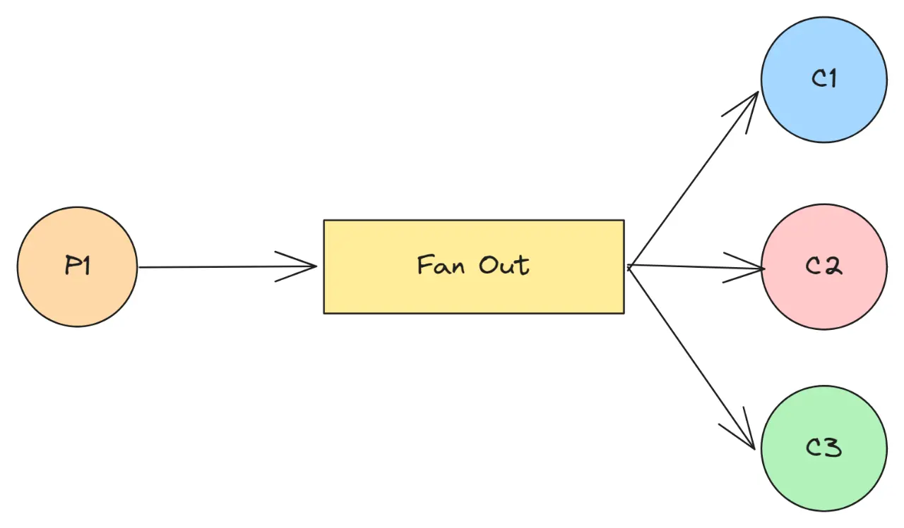

# Coroutine

A `coroutine` is an instance of a **suspend-able computation**. It is conceptually similar to a thread, in the sense that it takes a block of code to run that works **concurrently** with the rest of the code.

However, a coroutine is not *bound* to any particular user level thread. It may suspend its execution in one thread and resume in another one. This scheduling of coroutines is handled by the Kotlin `dispatchers` similar to [go runtime](https://king-11.github.io/blog/posts/goroutines/#go-runtime-components)

Coroutines are **less resource-intensive** than JVM threads. Code that exhausts the JVM's available **memory** when using threads can be expressed using coroutines without hitting resource limits.

## Suspending Function
Suspending functions are at the heart of coroutines. They can **use other suspending functions** (like delay in this example) to **suspend** execution of a coroutine and free the thread for useful computation by other coroutines.
```kotlin
suspend fun doWorld() {
    delay(1000L)
    println("World!")
}
```

## Coroutine Builders
To actually build a coroutine we need to use coroutine builders which cater to multiple different scenarios where coroutines can be used.

### Launch
A `launch` coroutine builder returns a `Job` object that is a handle to the launched coroutine and can be used to explicitly wait for its completion.
```kotlin
launch { // launch a new coroutine
	delay(1000L) // non-blocking delay for 1 second (default time unit is ms)
	println("World!") // print after delay
}
```

### CoroutineScope
A `coroutineScope` builder can be used inside any suspending function to perform multiple concurrent operations
```kotlin
// Concurrently executes both sections
suspend fun doWorld() = coroutineScope { // this: CoroutineScope
    launch {
        delay(2000L)
        println("World 2")
    }
    launch {
        delay(1000L)
        println("World 1")
    }
    println("Hello")
}
```

The main difference from `runBlocking` method is that it **blocks** the current thread for waiting, while `coroutineScope` just **suspends**, releasing the underlying thread for other usages. Because of that difference, `runBlocking` is a regular function and `coroutineScope` is a suspending function.

### Produce
We can also use `produce` builder where a coroutine is producing a **sequence/stream** of elements (very common in *producer consumer patterns*)
```kotlin
// infinite stream of integers starting from 1
fun CoroutineScope.produceNumbers() = produce<Int> {
	var x = 1
	while (true) send(x++)
}
```

>**Note:** All functions that create coroutines are defined as extensions on CoroutineScope, so that we can rely on [structured concurrency](https://kotlinlang.org/docs/composing-suspending-functions.html#structured-concurrency-with-async) to make sure that we don't have lingering global coroutines in our application.

### Async
There is another builder, `async` it is quite similar to `launch`. It creates a single coroutine but instead of forgetting about return value like the case with `launch` returned `Job`, `async` returns a `Deferred` (non-blocking future) that represents a promise to provide result using `.await()`.
```kotlin
val one = async { doSomethingUsefulOne() }
println("The answer is ${one.await()}")
```

Optionally, we can make `async` lazy as follows:
```kotlin
val one = async(start = CoroutineStart.LAZY) { doSomethingUsefulOne() }
one.start() // start lazily
```

Now that we have a concurrent environment where multiple coroutines are working simultaneously, we need mechanisms to synchronize data access/communication.

# Channels
Channels are **communication primitives** that allow data to be passed between coroutines. One coroutine can *send* some information to a channel, while another can *receive* that information from it in a **thread safe manner**.


`Channel` is represented by three different interfaces: `SendChannel`, `ReceiveChannel`, and `Channel`, with the latter extending the first two.

There are multiple kinds of channels:
- Unlimited Channel
- Buffered Channel
- Rendezvous Channel
- Conflated Channel
```kotlin
val rendezvousChannel = Channel<String>()
val bufferedChannel = Channel<String>(10)
val conflatedChannel = Channel<String>(CONFLATED)
val unlimitedChannel = Channel<String>(UNLIMITED)
```

***Note***: Both `Channel` factory function and [produce](#produce) builder take an optional `capacity` parameter to specify _buffer size_.

## Sending and Receiving
A Channel is conceptually very similar to `BlockingQueue`, except that its methods aren't blocking and instead of **suspending** nature.

| Blocking | Suspending |
| :--: | ---- |
| put | send |
| take | receive |

```kotlin
val channel = Channel<Int>()
launch {
    // this might be heavy CPU-consuming computation or async logic, we'll just send five squares
    for (x in 1..5) channel.send(x * x)
}
// here we print five received integers:
repeat(5) { println(channel.receive()) }
println("Done!")
```
>Channel `send` or `receive` functions can suspend when the channel is **full** or **empty** respectively. The channel can be **full** if the channel size has an upper bound.

## Closing
The producer can close a channel to indicate that no more elements are coming. Conceptually, a [close](https://kotlinlang.org/api/kotlinx.coroutines/kotlinx-coroutines-core/kotlinx.coroutines.channels/-send-channel/close.html) is like sending a special close token to the channel.

A receiver iterating on channel stops as soon as this close token is received, so there is a guarantee that all previously sent elements before the close are received.
```kotlin
launch {
    for (x in 1..5) channel.send(x * x)
    channel.close() // we're done sending
}
// here we print received values using `for` loop (until the channel is closed)
for (y in channel) println(y)
```

# Patterns
We can use the channel data structure to implement multiple concurrency patterns frequently used in concurrent/parallel programming.

## Producer-Consumer
Channels simplify implementation of *producer consumer pattern* in kotlin to a large extent with a large set of easy to use functions. We can use the `produce` builder on producer side and an extension function `consumeEach`, that replaces a `for` loop on the consumer side.
```kotlin
// producer builder channel
val squares = produceSquares()
// consumeEach utility
squares.consumeEach { println(it) }
```

## Fan-out



**Multiple** coroutines may **receive** from the same channel, distributing work between themselves. Unlike `consumeEach`, `for` loop pattern is the safe option to use when multiple coroutines are receiving because a consumer written via `consumeEach` always consumes (cancels) the underlying channel on its normal or abnormal completion leaving other coroutines aborted as well.

# Shared Data
Coroutines can be executed parallelly using a multi-threaded dispatcher like the `Dispatchers.Default`. Given the scenario of parallel data access we have to prevent unpredictable behaviour of data.

## Volatile
There is a common misconception that making a variable `volatile` solves concurrency problem, because volatile variables just guarantee **atomic reads** and **writes** to the corresponding variable, but do not provide atomicity of a **larger action** (like addition, subtraction, etc.)
```kotlin
@Volatile // in Kotlin `volatile` is an annotation
var counter = 0
```

## Thread Safe Data Structure
A thread-safe (aka synchronized, linearizable, or atomic) data structure provides all the necessary **synchronization** for the operations that needs to be performed on a shared state.
```kotlin
val counter = AtomicInteger()
```

This is the **fastest** and most **versatile** solution for this particular problem. It works for plain counters, collections, queues and other standard data structures and basic operations on them. However, it does **not** easily scale to **complex state** or to complex operations that do not have ready-to-use thread-safe implementations.

## Thread Confinement
Thread confinement is an approach to the problem of shared mutable state where all **access** to the particular shared state is **confined** to a **single thread**.
```kotlin
// confine each increment to a single-threaded context
withContext(counterContext) {
    counter++
}
```

This code works very **slowly**, because it does fine-grained thread-confinement. In practice, thread confinement is performed in **large chunk**s, e.g. big pieces of state-updating business logic are confined to the single thread.

## Mutex
Coroutines have `Mutex`. It has `lock` and `unlock` functions to delimit a critical section. `Mutex.lock()` is a **suspending** function which does not block a thread. There is also `withLock` extension function that conveniently represents:
```kotlin
mutex.lock()
try { ... }
finally { mutex.unlock() }

// using withLock
withLock(mutex) {
    try { ... }
}
```

# Cancellation


Just launching the coroutine isn't sufficient, at times even the good humans of this world have to become a part of **cancel culture** set by *Mr. Popatlal* to cancel some long running background coroutine.
```kotlin
var job = launch {
	delay(500L) // i will sleep
}
delay(200L)
println("cancel culture ftw")
job.cancel() // ask it to cancel
job.join() // wait for it to complete
```

> There is also a `cancelAndJoin` utility method.

## Cooperative
Coroutine Cancellation is of **cooperative nature**, the cancelled coroutine has to agree with cancellation and stop the computation. If a coroutine isn't actively checking for cancellation signal then it can't be cancelled.

All the suspending functions in `kotlinx.coroutines` are cancellable, they actively check for cancellation signal and then throw a `CancellationException` when cancelled. So we shouldn't catch `CancellationException` without intent of stopping the computation.
```
try {
	delay(500)
} catch (e: Exception) {
	// log the exception, might have been a `CancellationException`
	println(e)
}
```

## Cancellable Computation
To ensure that the library or program that we write aligns with the cancellation requirements we can pursue below two options:
- Calling the `yield` suspending function which checks for cancellation at regular intervals inside the coroutine.
```kotlin
launch {
    while (true) {
        // large computation
        yield()
    }
}
```
- Checking the `isActive` extension property available inside the coroutine via `CoroutineScope` object
```kotlin
launch {
    while (isActive) {
        // large computation
    }
}
```

# Conclusion
Kotlin is an amazing language I genuinely had fun writing code in it during 2023's [Advent of Code](http://github.com/king-11/AdventOfCode) ~~which I didn't complete :'(~~. I have felt this feeling last with `C#` and `Golang` ~~not rust~~. Let's cover this thought about joy of programming in a well articulated blog later so stay tuned.

Thanks for reading, you guys keep me going I am planning to start publishing my blogs on `Medium` as well for better reach to increase my [Luck Surface Area](https://github.com/readme/guides/publishing-your-work) till then adios, **Happy Makar Sankranti** may the wind gods be with you :) and yeah you know where to find me [@1108King](http://twitter.com/1108King)


