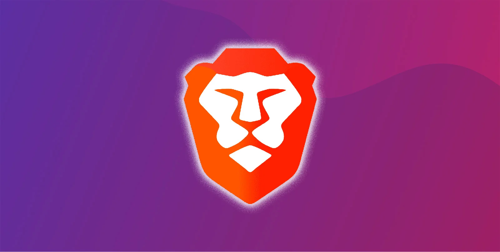
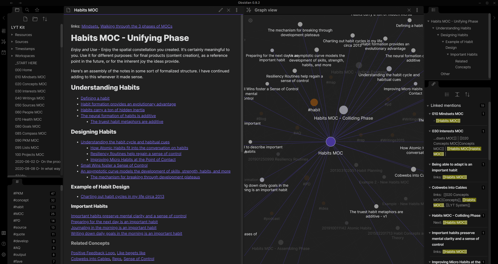
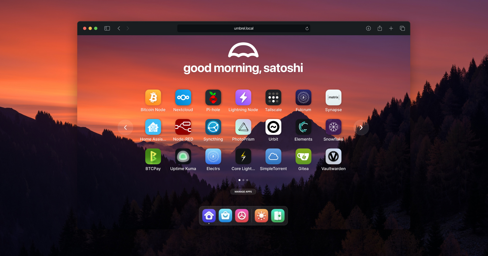
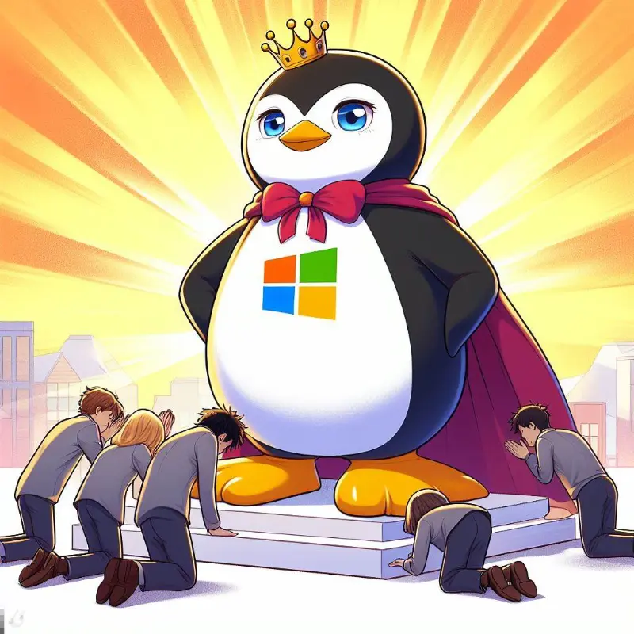

TL;DR and not for the weak hearted, please don't start reading this until you are willing to put efforts into changing the way you deal with online subscriptions.

# Childhood Fun
Since my childhood I was taught by my cousin brother **(Karan)** on how to utilize the amazing peer to peer network named torrent we used to keep our systems running late at night to just download a video game, dark ages I know.

Back in time when I was worthy I even hard booted my first phone (YU Yureka 2014) with alternative android based operating system Cyanogen (renamed to [LineageOS](https://lineageos.org/)).

My father got me a second hand computer first to experiment on, I do remember installing my first [Ubuntu](https://ubuntu.com/)/[Linux Mint](https://www.linuxmint.com/) but didn't quite understand it that time neither there were good online resources to help me so moved back to Windows. I used to break it down every other day and papa had to call Saini/Mahesh Uncle to fix and reinstall Windows.


Damn, those were good days (emotional moment), it was the time of flash sales we used to look up internet find scripts to run that would get us the product that we wanted quickly. Now after doing web development I can make those scripts myself I even help my father in auctions to get the contract in milli seconds using scripts.

# Moving away from Subscription Hell
I will try to break down things and go service by on what are the *possible* alternatives. Possible being the keyword these aren't the exact service of what the evil corporate gives you but it's very much doable to live with the alternatives. Because of course ~~nothing~~ not everything comes for free.

## YouTube Premium
Depending on platform that you are using Desktop or Android ~~(yeah shu go away iPhone users)~~ there are two solutions.

### Brave Browser
If you want to listen to the beats while working on laptop like I usually do just start using [Secure, Fast, & Private Web Browser with Adblocker | Brave](https://brave.com/).



Brave is the best browser probably if you are a **privacy enthusiast** and want to protect your data and habits aka yourself from the clutches of corporate data centres then use it.
- It is as fast as Chrome because under the hood they use Chromium only the engine that powers Chrome, Edge, etc.
- It blocks scripts, trackers, cookie banners, fingerprinting, [third party ads](https://brave.com/glossary/third-party-ad/), etc. and that's why the sites don't get stuck and frozen while browsing.
- It has its own privacy focused [search engine](https://brave.com/en-in/brave-search/) with AI features as well. It isn't as good as bing or google but well it boils down to making compromise because sometime you want privacy and sometimes you just want results.
- It enables https by default which keeps your [data secure](https://www.cloudflare.com/en-gb/learning/ssl/what-is-https/) over the wire from other people who can listen to all the online chatter.
So just install brave and head over to [Youtube Music](https://music.youtube.com) or [Youtube](https://youtube.com) to listen to your favourite songs without ad interruption

### ReVanced
It's **ReVanced** not **Vanced** before you start saying that Vanced was [discontinued](https://telegra.ph/Vanced-Discontinuation-03-19) not because it was an ad blocker but it was due to logo infringement.

Here is the [guide](https://www.reddit.com/r/revancedapp/s/212RnQA3th) that I used to install revanced on my Android phone and it just works. If it doesn't for you there are two options:
- Revanced is open source unlike Vanced so just go out there and contribute to the project by either providing a reproducible or if you can code just fix it.
- Pay up 👁️👁️

## Spotify Premium
There are multiple **modded** versions of Spotify available which just work fine still even with all the restrictions. I got one from [Ankit](https//wa.me/917979939400) you can ask him to :P or just a quick [search](https://search.brave.com/search?q=spotify+mod+8.7&source=desktop) gives you a lot of modded Android version ~~iPhone users shu shu~~ definitely available.

Well there is definitely **attached risk** for installing mod maybe it is some harmful app instead but well isn't that life :P. Everything is risk from stock markets to driving vehicle to **travelling to Himachal** but even the most chaotic of experiences won't stop me at least from getting that **adrenaline shot** of investing in a new found fund, going at **170km/hr** on Delhi - Mumbai Expressway, Returning to my beloved mountains on a trip to Nanital, etc.

## Cloud Notes

I keep **track** of every single thought of mine *blogs, shopping list, contacting people, good reads, healthy lifestyle, investments*, etc literally everything. Partially I write down some of the urgent notes from meetings into **diary** as well.

I use [Obsidian](https://obsidian.md) for writing down notes and thoughts it's just amazing and you will only know it's awesomeness after trying am even writing my blog in this. Now to sync it, I use [Syncthing](https://syncthing.net/), it's a cross platform app to keep files and folders between multiple devices in sync. I use it to keep my desktop and android obsidian in sync. Weekly I upload it to my self hosted [Next Cloud](https://nextcloud.com/) so that it stays good.

Obsidian comes with [Obsidian sync](https://obsidian.md/sync) as well which is $10/month it's costly so I definitely would not recommend it until you are not willing to make above efforts. You also don't have to use nextcloud you can just use **OneDrive** or similar alternatives as well.

# Self Hosting
Now this is the part am most excited about. I recently got a [Raspberry Pi 4](https://www.raspberrypi.com/products/raspberry-pi-4-model-b/) and installed [Umbrel OS](https://umbrel.com/), what umbrel offers is a plethora of self hosted alternatives to your regular cloud hosted things like which are just a single click away on their [app store](https://apps.umbrel.com/)


| Cloud Solution | Self Hosted Solution |
|:--------------:|:--------------------:|
|   One Drive    |      Next Cloud      |
|    Netflix     |       Jellyfin       |
| Google Photos  |      PhotoPrism      |
|   Podcasting   |   IPFS Podcasting    |
|      VPN       |    Tor Snowflake     |
|  UPI Payments  |    Lightning Node    |
| Bank Transfers |     Bitcoin Node     |
|    ChatGPT     |       LlamaGPT       |

I personally use all of them except **PhotoPrism** (Dad paid for Google One his mailing quota was going above 20GB limit) and **LlamaGPT** (I have access to Bing Chat Enterprise running on GPT 4 thanks to Microsoft 😼).

I can access my umbrel on my Local Area Network (LAN) which is provided by my Home WiFi Router through any web browser by going to https://umbrel.local . It's possible to access it remotely using **Tor Address** but that is a little slow but comes useful in case I have to show document which isn't available on my mobile.

## Vendor Lock In
When you use cloud hosted services you become at most of the times a victim of vendor lock in. As I wrote in my previous blog about [Loss of Customer Empathy | Backpacking Dream](https://king-11.github.io/blog/posts/customer-empathy/) the corporate world is more focused on **locking** you into their product rather than allowing you to easily **move away** from their service/product.

I discussed it in **Microsoft** with one of our **CVP PM** about vendor lock, he also agreed to the fact that it is **everywhere** but there is **additional value** attached with it for users using it for long periods of **time** so sometimes it's not bad. I concur, sometimes its good but it becomes bad when Google Photos won't even provide you with a delete all button 😿

Self hosted alternatives generally use an open source protocol/standard which allows you to easily move away from it if you aren't able to gather value out of it.

# Can't we just pay?
Let's calculate the bare minimum cost of self hosting:

| Product              | Cost  |
| -------------------- | ----- |
| Raspberry Pi 5       | 11460 |
| External HDD (1 TB)  | 5000  |
| SD Card (128 GB)     | 879   |
| LAN Cable            | 200   |
| Raspberry Pi Charger | 897   |
| Raspberry Pi Case    | 250   |
| Total                | 18686 |

Obviously this is the basic I personally use HDD -> SSD (2 TB) and Basic Case -> Metallic Heat Sink Case but that is just me you don't have to it varies on your use case. Now that is all until my **hardware fails** (generally SD Card) I have to get a new one but that would be all.

Let's compare to available cloud solutions calculated at an **yearly** cost.

| Cloud Solution    | Cost  |
| ----------------- | ----- |
| One Drive (1 TB)  | 5840  |
| Netflix (Premium) | 4800  |
| Total             | 10640 |
So a self hosted solution within two years will be more cost efficient than a cloud solution, with additional perk of no vendor lock in.

## Azure Student Offer
If you are a student currently and looking for cheaper alternatives because "*Lakshya we don't earn yet brother*". Don't worry kids [Azure](https://azure.microsoft.com/en-us/free/students/) has you covered, you can try multiple of the services like VMs, SQL Server, Apps, Functions, etc. with a monthly **100$ credit**. For our use case just spin up a VM and install all these services individually on it.


If you want to take it a little easy and just run **Umbrel** instead you can do so by installing **docker** on your Azure Linux/Windows VM and then run the [docker compose](https://github.com/getumbrel/umbrel/blob/master/docker-compose.yml) service with just a single command.
```bash
git clone https://github.com/getumbrel/umbrel
docker compose up -d
```

# *Mein nah sehta*
Enough said already but why am I going through so many steps and things when am well off enough to pay out for all these cloud services. Well the simple answer is
>mein na sehta bhai (I can't bear it brother)

As I already made well known in my [previous blog](https://king-11.github.io/blog/posts/customer-empathy/) that I hate corporates trying to make me feel like a fool even when am using their services so yes I won't bow down to them and provide them more of my data to keep in their silos and god knows what they do with it if I ever forfeit to pay for their services **I am taking control of my life my data.**

Second things come with my [upbringing](#childhood-fun). My cousin **Karan** taught me to be **opportunistic** and get the job done without paying a single dime of money. I realize that I am already paying enough of these taxes which don't provide me back with even basic service, I belong to the most **repressed** class of humans in Indian Society - **A general category, non EWS, salaried, male.** So yeah am willing to put in efforts to save a little money here and there.


Thanks for reading this through appreciate it. Looking forward to writing a little more consistently about life, finance, bitcoin and technology of course. You can reach out to me on **twitter** [@1108King](https://twitter.com/1108King)
