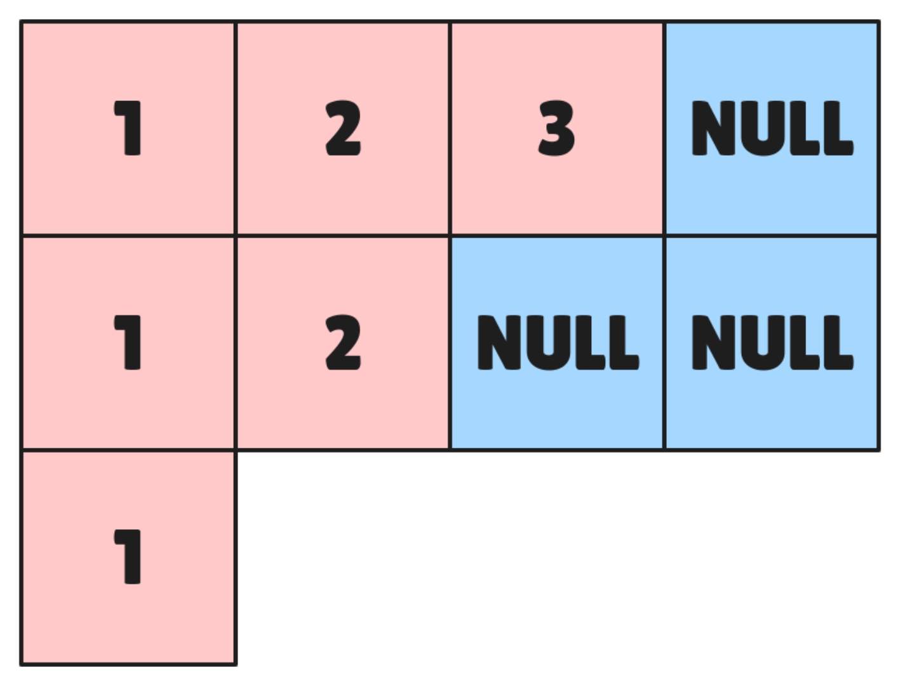
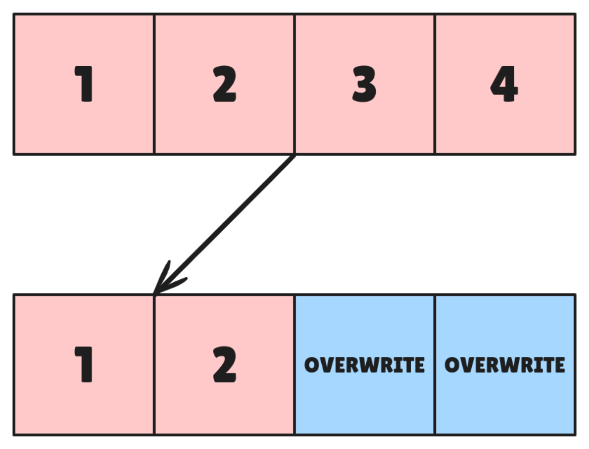

Modern programming languages that we work with these days have made memory management simpler that ever, they manage it on their own using things like garbage collectors, smart pointers, ownership, etc.

Creating an empty vector is as simple as
```rust
let empty_vec: Vec<i32> = Vec::new();
```

But some questions remain unanswered if you haven't tried manually doing memory operations like:
- how is a sized vector created using `Vec::with_capacity`?
- how is a vector resized on calling `pop_back` or `push_back`?
- and finally how is the memory freed when vector goes out of scope?

Let's engage in old god `C` as its closest we get to actual system calls and try to figure out these question **inside out**.


## Memory Allocation
To store a vector or object we need a backing address in the physical memory of our system. We use `malloc` to ask operating system for more memory which looks something like below.
```c
int* numbers = (int *)malloc(8 * 42);
```

In above code we are trying to create an array of numbers or more pedantically a `pointer` to integer which is the starting point of our array.

The parameter to `malloc` is the number of bytes we want to allocate. Given on a **64 bit** system an integer takes **8 bytes** so we are allocating for `42` integers.

`malloc` returns a `void *` which is `C`'s way of saying it can be anything so we have to *type cast* it based on our requirement and understanding.

### Dynamic Sizing
Generally we can't rely on hard coding the size of objects integers might be simple but can still vary on a **32 bit** machine. A more complex thing like a struct of multiple values will vary even more.
```c
struct foo
{
  int element;
  struct foo *next;
};
```

So its better to use a utility function `sizeof` for calculating size of our type.
```c
int* numbers = (int *)malloc(sizeof(int) * 42);
```

In case you are running on **512 MB** system and system runs out of memory `malloc` will return `NULL` value.

>It's not the `null` you see in `Java` and other garbage collected languages, `NULL` means a zero value something like `(void *)0` whereas the other keyword is used to identify a variable as not having any reference.

### Pointer inside Pointer
How about we handle an even more complex scenario
```c
struct wallet {
	int version;
	int *notes;
};
```

Now we have a dynamic array inside of a dynamic struct which we have to allocate memory for, using just `sizeof` will give an empty array to us and it will **segfault** if you try to access array's memory.
```c
struct wallet* w = (struct wallet *)malloc(sizeof(struct wallet));
// this will segfault
// w->notes[0] = 42;
```

So we have to allocate memory of the `array` of integers inside of our `wallet`.
```c
wallet->notes = (int *)malloc(sizeof(int) * 42);
```

### Zeroing Memory
If you use `malloc` the memory is allocated to us but its never zeroed out before we get it. It can have **garbage values** which if not cleaned can cause your program to behave in unexpected ways.


The solution for this is to use one shot allocation and memory zeroing using `calloc`.
```c
w->notes = (int *)calloc(4, sizeof(int));
```

`calloc` allocates an array of size `4` where size of each element is `sizeof(int)`. The returned memory is set to zero.

Now the question arises why not always use `calloc`:
- First it only works for **array** allocation so you can't allocate a `struct` using it.
- It is **slow**, in case you don't need to zero memory out and pass the buffer to some other function which maybe reads the file or does some other `io` just use the big brother `malloc`.

## Resizing
To answer the next question that we had in regard of a `vector` is basically related to allocating more memory and de-allocating extra memory. We do that using `realloc` function.

We will declare our vector struct as below it will track backing store, current position and total size of store.
```c
struct vector {
  int *backing_store;
  int current_position;
  int backing_store_size;
};
```

When we call `push_back` the vector checks whether the size of its backing store is sufficient or not. If not, it allocates a backing store of **double size** using `realloc` and the places the element there. The newly allocated memory will be **uninitialised**.
```c
void push_back(struct vector *v, int element) {
  if (v->backing_store_size <= v->current_position) {
	v->backing_store_size = v->backing_store_size * 2;
    v->backing_store = (int *)realloc(v->backing_store, sizeof(int) * v->backing_store_size);
  }
  v->backing_store[v->current_position] = element;
  v->current_position = v->current_position + 1;
}
```

Similarly, we can handle `pop_back`, just one crucial optimisation we won't reduce to half but instead if current position is less that `1/4th` of backing store size then we reduce the backing store to **quarter** of its previous size.



All the functions above return a `NULL` value in case of error and set `errno` which is `C`s way of communicating error kind.

## Freeing
It's also important that we keep our memory usage in check otherwise it can **exceed** the physical memory **capacity** really fast. We have to `free` unused memory and return it back to the operating system.


It's done using `free` function call, you pass in the pointer where memory is allocated and it will return it back to the system.
```c
int* numbers = (int *)malloc(sizeof(int) * 42);
free(numbers);
```

## Common Errors
The rise of **~~RUST~~** memory safe languages, paradigm like [smart pointers](https://en.cppreference.com/book/intro/smart_pointers) in C++ and system like [RAII](https://en.cppreference.com/w/cpp/language/raii) is because of the reason that there are so many memory issues that keep happening in systems.

The recent [Crowd Strike](https://www.youtube.com/watch?v=H9RSeDUdkCA) one was also a memory issue where [invalid memory buffer](https://x.com/Perpetualmaniac/status/1814376668095754753) was being accessed.


Let's go over some common gotchas that you have to keep in mind while managing memory.

### Invalid Free
Accessing a memory which was already **freed** will cause **SEGFAULT** and trying to free (double free) it again is an **undefined** behaviour you might not wanna encounter.

Free expects a pointer from the result of call to `malloc` passing anything else will also result in erroneous program execution.

### Less Allocation
It's possible you might have allocated less memory than required or no memory at all for an operation in which case **buffer overflow** will happen or **SEGFAULT**.



>It is one of the `binary exploitation` ways [hackers](https://owasp.org/www-community/vulnerabilities/Buffer_Overflow) use and will probably cost your service a lot of secret credentials.

```c
char *src = "hello world";
char *dst = (char *)malloc(sizeof(char) * 4);
// dst has size 4 while required is strlen(src) + 1
strcpy(dst, src);
```

>In above example we could have probably used `strdup`.

### Garbage Values
Accessing **garbage** or **uninitialised** value without clearing your memory will result in undefined behaviour of your program. It's sometimes good to use `calloc` or clear memory on your own.

### Memory Leak
Allocated memory is returned back to operating system when program dies even if you don't call `free` on your own.

But that's only in case of short running processes, in case of long ones like **databases** and **servers** if you don't free unused memory, the memory allocated to program will keep increasing and finally your system will run out of available memory leading to **crash.**


## Finding memory issues
[valgrind](https://www.usenix.org/legacy/publications/library/proceedings/usenix05/tech/general/full_papers/seward/seward.pdf) is one of the tools we can use to identify memory related issues. It can tell us about:
- uninitialised reads
- invalid memory read/write
- memory leak
- invalid free, and a lot more

For a buggy program like this
```c
int *data = (int *)malloc(sizeof(int) * 100);
data[100] = 42;
```

It will tell us about the invalid write if you run it through and also about the lack of a `free` call.
```bash
gcc -g test.c -o test
valgrind --leak-check=yes ./test
# Invalid write of size 4
# 400 bytes in 1 blocks are definitely lost in loss record 1 of 1
```

In case we try to access uninitialised memory and run it through `valgrind` it will let us know
```c
printf("value at index 11", data[11]);
# Use of uninitialised value of size 8
```

## Conclusion
Knowing about memory management is very crucial to build **safe** and **performance** critical software which basically is every software.

Offloading tasks to garbage collectors in programming languages with automatic memory management does make it easy but things like memory leak can still happen there so you should know what's happening in your program otherwise **AI replacement** is coming for you :P.


That was all for this week, I wrote this piece after reading through [Operating System: Three Easy Pieces](https://pages.cs.wisc.edu/~remzi/OSTEP/) its a very nice book with *exercises* and *references* to research papers I am enjoying reading it will keep sharing my learning from it as I try to complete it ~~fingers crossed~~.
