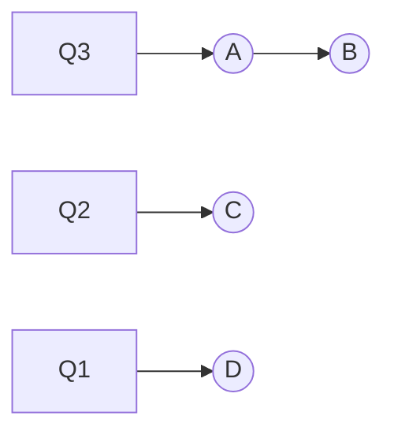
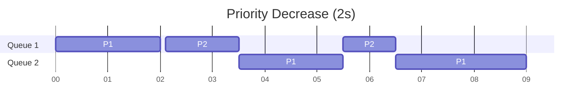
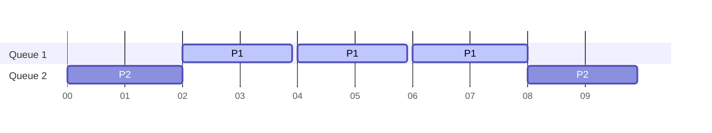
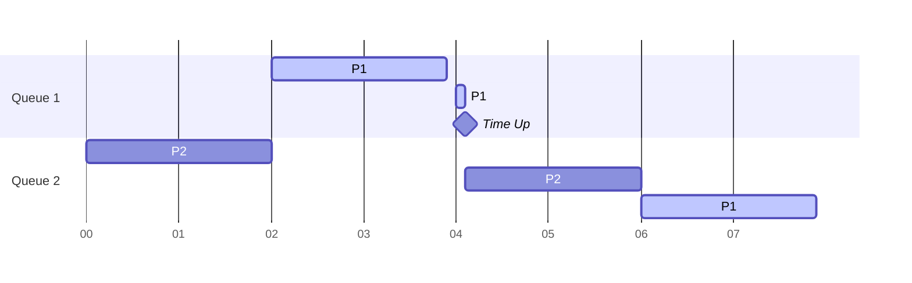

**Multi-Level Feedback Queue** algorithm was designed to address problems associated with existing scheduling algorithms i.e. providing a good response and turnaround time resulting in a balanced scheduling algorithm which can cater to a general purpose CPU requirements.

It can do so without needing to have any prior information about the executing processes. It develops its knowledge about them on the fly and hence modifying its approach on how to share the CPU time between them.

## Quality Metrics
**Round Robin** is the algorithm that is able to provide better **response time** ~~usually~~, which is a very good choice if you have several interactive processes running that each needs a piece of CPU time on a regular basis. It's able to do so based on a good selection of **time slice length** providing all applications an equal share of CPU on a regular interval leading to good **interactivity**.

**Shortest Job First**/Shorted Remaining Time First (preemptive version) is able to complete the jobs at a very rapid pace due to **greedy selection** of which task to process given the *information* about how long the task will run for. Hence, resulting in superior average **turn around time**.

```mermaid
---
displayMode: compact
---
gantt
	title Round Robin Scheduling
	dateFormat ss
	axisFormat %S
	section Process 1
	P1 : 00, 2s
	P1 : 06, 2s
	section Process 2
	P2 : 02, 2s
	P2 : 08, 1s
	section Process 3
	P3 : 04, 2s
	P3 : 09, 1s
```

```mermaid
gantt
	title Shortest Job First Scheduling
	dateFormat ss
	axisFormat %S
	P2 :a1, 00, 3s
	P3 :a2, after a1, 3s
	P1 :a3, after a2, 4s
```

The average response time is
- Round Robin: `(0 + 2 + 4)/3 = 2s`
- Shortest Job First: `(0 + 3 + 6)/3 = 3s`

The average turnaround time is:
- Round Robin: `(8 + 9 + 10)/3 = 9s`
- Shorted Job First: `(3 + 6 + 10)/3 = 6.33s`

SJF can be a good option but there is a very unrealistic assumption we make for it, *"we are aware of the time a process will take to complete"*, which is actually **in-deterministic**.

So let's start with understanding how does MLFQ combines these two algorithms.

## Multi Level Queues
As the name suggests instead of a single process queue we use multiple distinct queues with different priority levels. **Q3** is given the highest priority and **Q1** the least.

The rule for any CPU to select a process to run is as follows:
- Priority(A) > Priority(B): A runs B doesn't, atleast until A's completion.
- Priority(A) = Priority(B): A & B run in round robin manner.

Now a snapshot of the queues at any particular instant doesn't give a good idea about the dynamic nature of MLFQ which learns from previous execution of process and updates its state.

## Priority Feedback
We can assume generally that an **interactive/short** job which give up its CPU time share to do some I/O or reaches completion early needs to have a **good response time** hence has to be prioritised, whereas a long running **CPU bound** process needs good **turn around** time but not a quick response.

So MLFQ with no details about the total execution time
>Starts with assumption that process is either a short running or an interactive job and hence is placed in the highest priority queue.

Now to decrease priority over time we use the below rules:
- If the process **consumes** its complete time slice we **reduce** its priority.
- If the process **gives up** its time slice before its up, it stays at the **same** priority.

Now there are two issues with our current system let's try to remedy them

### Starvation
In presence of a lot of I/O bound or short processes a long running **CPU bound job** sitting in the lowest priority queue will suffer starvation. Also it might be the case that a process **started** as CPU bound but now **became** I/O bound.

```mermaid
gantt
	dateFormat ss
	axisFormat %S
	tickInterval 2s
	section Queue 1
	P1 :crit, a1, 00, 3s
	P2 :a2, after a1, 1s
	P3 :a3, after a2, 2s
	P4 :a4, after a3, 3s
	P5 :a5, after a4, 2s
	section Queue 2
	P1 :crit, after a5, 4s
```

In both the above scenario we can use a new rule for priority boosting.
- After some time period **S**, all the jobs are moved to highest priority queue.

```mermaid
gantt
	dateFormat ss
	axisFormat %S
	tickInterval 2s
	section Queue 1
	P1 :crit, a1, 00, 3s
	P2 :a2, after a1, 1s
	P3 :a3, after a2, 2s
	P4 :a4, after a3, 3s
	Priority Boost :milestone, 09
	P1 :crit, a5, after a4, 3s
	P5 :a6, after a5, 2s
	section Queue 2
	P1 :crit, after a6, 1s
```

>**S** here is what we call a **voo-doo** constant that needs to be configured properly by a senior level engineer based on his understanding about the requirements of a system.

### Game the Scheduler
Now an expert programmer who has read through the draft of our open source MLFQ standard can try to game our scheduler for his application to consume all the CPU time.

By manually inserting **unnecessary I/O calls** into the process just before end of time slice and then restarting after a short span, it can make the scheduler think that since process is giving up its time slice it can stay in highest priority queue.

To remedy this our algorithm can use better accounting here, in form of a new rule:
- Once a job a uses up its **time allotment** in a particular queue we reduce its priority **irrespective** of how many times it gave up CPU time.

## Tuning MLFQ
Generally, we keep **short time slice** for high priority queue consisting of interactive processes and it keeps on **increasing** as the priority decreases and we reach CPU bound processes in low priority queues.

In some implementations of MLFQ scheduler the highest priority queue is reserved for **operating system** processes so user created ones can never enter there. In some cases user can issue command ([nice](https://man7.org/linux/man-pages/man1/nice.1.html)) to increase or decrease the priority of a process.

Now, there are multiple parameters when it comes to configuring the MLFQ so "*how do we set them for optimal setup?*" is a question that arises in mind.
- How many queues should be there?
- How often should priority be boosted?

As a senior software engineer would say

After my unsuccessful attempt at learning about operating systems through my bachelor's degree program I have started reading the book **Operating System Three Easy Pieces** to better my understanding of it. OS is the key for understanding how our high level applications will function.

Thanks for reading through my blog, as always I look for your feedback which you can provide by reaching out to me [@1108king](https://twitter.com/1108king).
