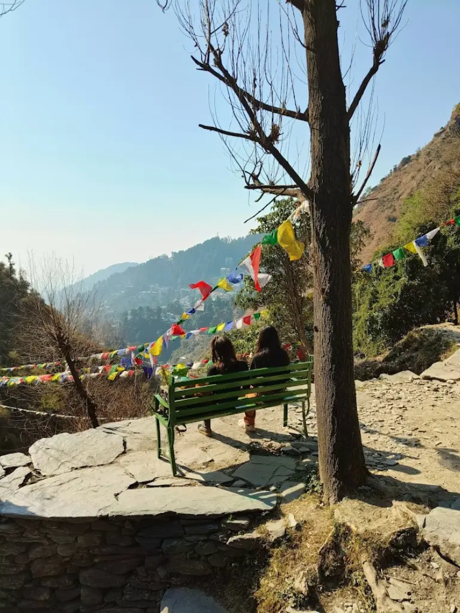
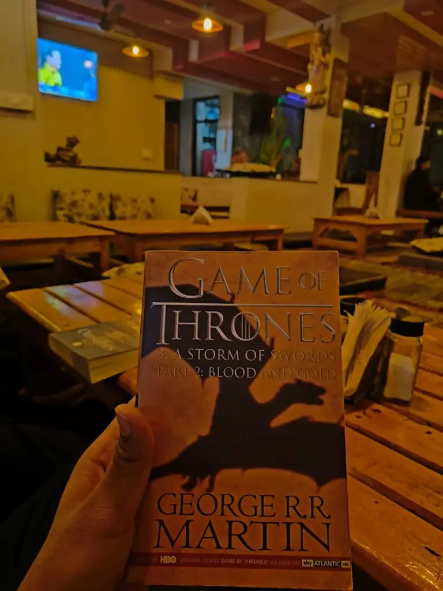

While New Year wasn't a reason for me to go on a trip but it was more on the side that I visit North Sparsely these days so this served two purposes:
- I can meet my beloved friends of the North
- Visit the Himalayas which gave me a new direction ~~and spine restrictions~~ in life.

## Planning
Obviously these rookies, Pallavi and Kushal weren't going to plan so all came onto me 😤.

I went through a few blogs on **tripoto** rather than looking at the worst possible trip experience that most tour packages give which hastily make us visit the tourist attractions.

I planned a rough itinerary for the 5 days (one day to chill), booked their train tickets, booked bus tickets and hotels with my new **ICICI Rubyx Credit Card** 💳.

# New Delhi - Day 0
Rather than getting into details about my grandma badgering dad on how he has lost control over his son who won't listen to him and go back to the same place, let's jump right into Indian Railways and head towards Delhi Cantt.

Pallavi and Kushal were coming from Vande Bharat *sleepless*, my train was also late courtesy of fog but still I wanted to visit **Shivansh Bhaiya** first and then go to them since the guy took *"break a leg far more seriously"* ☠️.

After meeting shivansh bhaiya for a brief time and having 1hr catchup I rushed to Majnu ka Tila on catch our bus where both of my fellow travellers were enjoying Ramen 🍜. As soon as the bus started reaching hilly areas panic was coming into play a little for me and more for Kushal this guy just couldn't sleep.

# Bhagsu - Day 1
We arrived at 6AM at **Bharat Petroleum** in Mcleodganj from there we took a cab  till **Moustache Mcleodganj** which is actually in Bhagsu this costed us Rs. 550.

Early morning no one was there at hostel we called a few numbers and somehow reached the previous care taker of hostel who runs his own hostel now **Rahgir** but he called the current manager and we checked in.

## Mcleodganj Tourist Attractions
With a broken right blue toe nail along with new found swelling on left toe we went to the Mcleodganj Market for Brunch and Shopping. We walked from Bhagsu till there while clicking pictures as vehicle on moutain was a big NO! iykyk.

I had already curated a list of cafes first we went to **The Four Seasons Cafe**, it is a humble place with very good Tibetan Food. We tried
- Tofu Thupka (9/10)
- Steam Momos (8/10)
- Tomato Basil Bruschetta (9/10)
- Lemon Tea (for me 😌)
All of them were amazing 🤤 we went once again the same day because pallavi wanted to eat more tofu and kushal wanted to eat more ~~maida~~ noodles

After this we went to the **Dalai Lama Temple** to pray God that:
> Bhagwan 100-200 zyada lelo but iss baar zinda niche pahucha Dena.

Jokes apart Buddhist monastery are always so nice, peaceful and quiet. We took some rest as my toe was shouting at me. While I sat pallavi asked to click some good sunkissed photos of her through like light coming out of canopy.

Next we went for shopping I bought:
- Buddhist Flags for my bike
- Fridge Magnet for my flat
- Shawl for Mom from Tibetan Refugee Market (tried getting this from jibhi last time)
- Himachali Traditional Cap (for papa)
- A traditional overcoat (for my little sister)

I had conversation with Tibetan Aunty asking where do you get these is it handmade she is like idk it just comes and we sell for living.

Next these dessert hungry manicas with there normie navigation skills took us to the German **Wosser Bakery** 🧁. I joined there troupe for dessert maniacs even with my sugar reluctance because of how amazing the desserts were. We took:
- Walnut Tart (10/10 which pallavi couldn't eat as it has eggs)
- Chocolate Mousse (9/10)
- Banana Cake (10/10)
- Milk Tea (pallavi ofc)

There was also **Kalchakara Temple** which was not to grandeur but had a large Buddhist Prayer Wheel which can get you good karma 🕉️

Since, my toes were hurting a lot we sat a while on the **Mcleodganj Chauk** and savoured Softie 🍦 then we headed back to Bhagsu along the route a beautiful sunset was happening which was definitely capture worthy.
## Dusky Night
In evening we went to the **New German Bakery** for dinner and given my preference for Indian food we had it:
- Kadhai Paneer (9/10)
- Dal Fry (10/10)
- Tandoori Roti (8/10)

Pallavi wanted to get the same overcoat as the one I bought for my sister, we went on a night stroll to find one for her instead we found one for me instead I planned on buying it next morning to wear here and then give to my brother as Hyderabad is not at all Cold. We requested the shop keeper to get a smaller size one for her which we will collect in morning. The **traditional overcoat** is super soft, keeps you warm in the shivering cold and it looks real classy on a smart ass like me 😛.

Time to sleep now **Tirund Trek** was tomorrow, we asked our Hostel Manager about it he got us a Guide who will take us, setup our tent on top, dinner and breakfast, bonfire and then come back ~~on your own~~ with the guide.
# Tirund Top - Day 2
I woke up early as usual around 7AM took a *non hot water* bath in shivering cold to heat my body up. Our trek guide was to arrive at the Hostel itself around 10AM, meanwhile we went down to the Taxi stand for having a heavy breakfast which will keep us going till dinner time at Tirund Top.

## Breakfast 'n Shopping
We ate freshly cooked hot aloo pyaaz parathas with pallavi's favourite milk tea, Kushal for some reason was leaning on ~~sugar filled~~ mazza. After this since we had time we went to market to get our overcoats, I bought the big class gray one, little fella pallavi got a pink one which had better fitting for her and we were twining.

## Standard Trekking Procedure
While we were sitting in the hostel common area our guide arrives and he makes us sign a form which said company is not responsible for your death, my mind cursed ~~behenchod~~ so hard on it because of previous ~~mis~~ [happening](https://king-11.github.io/blog/posts/return-of-jedi) iykyk.

I asked him how can I sign something like this will you ensure I return back safe, he said sir don't worry will bring you back safely it's just standard operating procedure for no liability. We gave him the decided upon money (Rs. 1000 x 3) even though I requested to just take half in the start of trek and half when trek is done but he wouldn't budge so anyhow.

Guide told us not to buy at **Shiva Cafe** or anything along trek route as rates would be straight up **x2** or **x3**. So we bought **energy bars (snickers), chewing gums, etc**. from the starting point of trek to aid in making us till the top and we had already filled three **water bottles** from the hostel.

## Trekking to Top
Trek begins along route to Shiva Cafe at ~~dry~~ **Bhagsu Nag Waterfall** there was a stick seller. These fellow travellers of mine were leaning on to buy even the seller was like see the top there it is so steep and high you have to go there till top it's not easy. I said No! and he just to scare me more said **BEST OF LUCK!**, long story short stick is more troublesome then just carrying your body up and down the mountain.

At Shiva Cafe there was a park bench looking down the valley and one **German Girl** was sitting there. Pallavi wanted to ask her to move and get solo photos of herself. But I told her with two of you beautiful girls frame would look even more good.

There were many points along the way to take rest where we had one-one sip each of water not much just bare minimum to prevent bloat. We each had **1 energy bar** and **1 lottie choco pie** along the 10 km trek, sugar is the key. Many of the rest stop owners had **pet doggos** there to these good bois I gave lot's of head petting and neck scratches. One of them went with us till the top.

We clicked a lot of good cool kid photos along the route even with our bodies drenched in sweat and cold winds making us shiver whenever we stopped. Kushal and me were always motivating Pallavi who was exhausted like hell and was in her punk mode cursing us and roasting *most eligible single bachelor* kushal 😝.

We bought one Gatorade at 85% point and as said by guide it was Rs.80, twice the MRP but heck we needed it. Finally we reached top, it was amazing the view below was incredible, I shouted **wohooo'd** like a crazy man and my mind was hoping someone just please play [On Top of the world - Imagine Dragons](https://music.youtube.com/watch?v=w5tWYmIOWGk)

## Top of the World
Guide was setting up our tents, were looking around the top and clicking pictures. The one which were using a lot was "*we have to reach there before sunse*t", it was going to happen at 6PM whereas we reached at 4PM, ezy clutch.

I took some rest as my toe was hurting like while pallavi and kushal went for a tea leaving me alone in the tent 😔. I changed into my PJs and got my camera ready to click more photos at Sunset.

The sunset was unreal for us, the sun started shrinking into a small eye of fire while getting enveloped by cloud horizon. There was a straight line of clouds in the sky where sun was ending it's journey for the day. The colors of sky were amazing filled with amber the clouds caught fire and I focused my DSLR to capture this moment of time.

We went up and talked to the other troupe of people, they were fun. The diversity of people on that small top was surreal, doctors, engineers, youtubers, businessmen, MBA students, etc. everyone was there to get a sight of this beautiful view.

## Bon Appetit and Fire
Our guide cooked us food and served in leaf plates, there was Dal, Rice, Mixed Vegetable and Roti. While I feasted on rice with dal and mixed vegetable which was delicious (10/10), I took extra rotis (7/10) to **feed the doggo** who had come with us till the top and was *shivering* in cold now, the food would generate some heat in his body to keep him good.

We got our three sleeping bags and went inside our tent till the time **bonfire** was there. During bonfire we talked to people, cracked jokes on the other troupe for talking so loudly, had some OG **oldmonk**, etc.

I went into sleep after I got Kushal and Pallavi wrapped inside there sleeping bags properly. We even got **two bags** for pallavi as she was shivering too much.

**Pallavi taking over for Day 3**
# Dharamkot - Day 3
Day started with a beautiful **sunrise** amidst the mountains, I felt it was so surreal, the sun coming out of the mountains, exactly like the one I used to **draw during childhood**.

Then we had our breakfast, chole-bhature. I don't know if it was the mountains, the shivering cold or the company which made the food taste so delicious. We also shared our food with the mountain doggu. After packing our bags and started trekking downhill to the hotel, we took a halt at Bhagsu Nag waterfall..special thanks to my bois for holding me when I fall (it was 3 times, as I remember :').

## Nail Polish Survival
After reaching back to the dorm, we got freshened up and headed to our next destination which was **Trek & Dine cafe**. But before that, while we were getting ready, I saw one fellow traveller staying with us in the hotel, he asked me whether I have **nail polish**, I checked in my bag and found one so gave it to him, I asked him the reason so he explained that the **fungal infection** in the toe can be prevented by nail polish (indeed a new fact for me).

I told the same to Lakshya as he was also having some infection in his toe, then comes the moment when I was applying nail polish to my boyfriend (reverse na? that's how we do things..lol xD ).

## Trek n Dine
**Krishna** (the same nail polish hack guy, of course, he had a name!) suggested we try out **Moonlight cafe**, we checked Google Maps, and both the cafes were nearby so we started our journey toward trek & dine (as the name suggests - "**TREK**" & dine ).

We almost did trekking for around an hour to reach the destination - Dharamkot ( hail Google Maps :') ) and the best part was, Trek & dine was **closed** but thankfully Moonlight was the savior for us. It was a cozy aesthetic place with delicious food (loved the humus there) We also had mushroom pizza (yummy), hot chocolate (which tasted like bournvita), pasta (spicy for me).

Then for deserts we headed towards **Flugler cafe** (again Krishna Bhaiya's suggestion), we had banana pancake there (which I did not liked).

## Netflix and Chill
Dharamkot was serene and beautiful, while returning we clicked a few pictures on our detour and decided that we would have our dinner at **Raku's cafe** (which was around 50-100m from our Hotel). Oh, I forgot to mention! My dear boys also got some **beer** along with **cosmopolitan** mixer. In the late evening, we decided to watch a movie, "**Kho gaye hum kaha**" - it was a nice movie! We liked it.

Then it was time for dinner so we went to Raku's Cafe, we already had decided to have our comfort food (**daal - roti -sabzi**) for dinner so ordered the same along with a hot chocolate (it was good from the one we had at Moonlight), the food was okayish.

## The Backpacker
We returned to the dorm and in the courtyard we saw Krishna bhaiya sitting along with Moustache wale bhaiya. Also there was a **bonfire** so we sat along with them and had a chit-chat session. Krishan bhaiya narrated to us lots of stories (**supernatural ones**), his experiences of travelling across Himachal, and stuff (he also offered us **Bacardi White rum** - which Lakshya had). Then we returned to the dorm, finished the movie, and went to sleep :)

# D-Day - Day 4

While I was suffering from the supernatural scares from the night as the same thing happened on the night before my accident. **Deja Vu** was hitting super hard. Even though we had booked stay for one more day Moustache Hostel bhaiya was kind enough to remove that as we were leaving early.

Anyhow just like a good kid I was in my routine woke up early took bath did my skin care routine and sat down on laptop as a good corporate slave.

## Microsoft Life
While Kushal and Pallavi were chilling and exploring markets I was stuck with my laptop in common area. But gotta love my company and manager who give me **flexibility** of working from anywhere in the world so a big thanks to Microsoft and Jatin (my manager) ~~ain't getting promotion for this~~.

For breakfast we went to the **Old German Bakery** as per Krishna Bhaiya's recommendation. I ordered an English Breakfast with Ham (10/10) and orange juice to finally get some protein. It was delicious. We also had tofu scramble (10/10) which we ordered not once but twice it was that good. The coconut tea was alright and different.

One more guy the previous hostel manager joined us there as well. He was backpacking across **Europe** for around 1 year or something without a job doing odd jobs to just live like a **hippie**, A true backpacker indeed.

*A few hours of work...*

## Pack up time
For the lunch we went out to the market on foot and ended up in **The Tibetan Kitchen**. The orders we made were based on google maps review:
- Tofu Thukpa (9/10), bland and fulfilling
- Fry Thenthuk (9/10) was nice and spicy
- Tinmo bread (7/10) supposed to be a speciality but too much fine wheat and bland for kushal's taste buds
- Matcha Boba Tea (10/10) a healthy drink to go with and was equally tasty highlight for me.
Since these guys were unsatisfied we went to Wosser Bakery again where I was taking my **meetings** while they both enjoyed some of the lovely desserts. That day I understood over our debate on sugar consumption that S in Kushal stands for Sugar.

On the way back to hostel I bought a **wind chime** for home and dream catcher for shriyanshi.

On return me and pallavi got some photos in our **traditional himachali overcoats**. In evening I bought Pallavi a muffler and took some beautiful photos of her ;). I packed some aloo parathas for us to have in the bus.

Since my day job had ended we got some spare time and all of us were **reading books** from the amazing collection that Moustache had. We also played **jenga** and ofcourse I ~~was~~ wasn't the one making it fall everytime.

## Deja Vu Decent
Our hostel caretaker got us a cab (Rs. 500) we had a little chat with the driver who told about off season which turned out great for us atleast leading to a fully peaceful stay. We reached the petrol pump in Dharamshala from where we were supposed to take the bus.

Pallavi was a little dizzy and was puked a little while we went to bring her some cold drink to remove nauseousness. The bus began and so started hitting my trauma. The bus was **swinging** which scared me to the death, it was not a very new and joyful feeling for me. I was panicking and wasn't able to sleep at all.

**Hard Brakes...**

Something happened in middle of road we stopped which shook all the passengers. I just wanted to get tell the driver a big fuck you and get off the bus but I tried to calm my nerves a little. **Srishti** had given me a shlok to read in such a time:
>|| चलत विमान कोलाहल होइ जय रघुवीर कहत सबकोइ ||

This shlok along with **Hanuman Chalisa** were my tools of devotion to request god to keep me safe from going through such an experience again. Nothing worked but **sleep** wrapped me in comfort. When I woke up we were on plain land. Me and kushal were overjoyed on being able to stand on my feet instead of being inside ambulance.

On reaching New Delhi we spent sometime in the Maharana Pratap Bus stand just chit chatting and **recalling** what great fun we had and memories that we made.

# Care for Nature
That completes our journey thanks for reading through. If you enjoyed do go there to Mcleodganj, rest in the lap of nature while having fun with your friends or family and feel free to share this blog.

A very **humble request** from my side would be to ensure that you **don't litter** these places by throwing wrappers and bottles anywhere you feel like. Keep them in your bags and throw them in dustbins only. It really did **hurt** me when on decent I saw the kind of pollution that was done to this heavenly place even on tirund top.

If we humans want to keep enjoying the nature and its beauty its high time we stop taking it for granted and take necessary care when venturing in mother nature.

