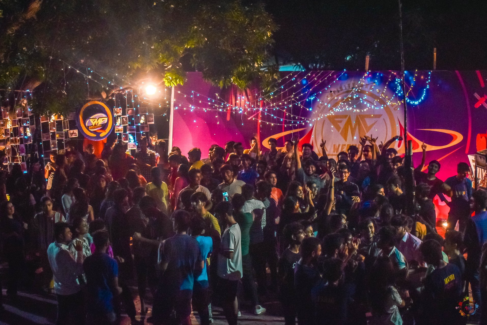
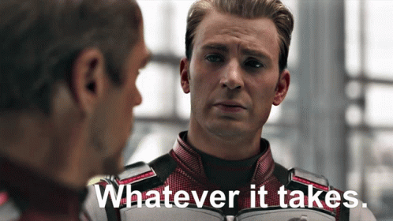

# Why we need our Campus?

## Do you remember?

Do you remember waking up early feeling that morning 🌅 breeze🍃 on your way to the **examination centre** where you probably gave the most crucial examination of your life? Making through those two years of constant efforts, strenuous days, full of ups and downs. All that for what a subscription to **online classes**?

Do you think the admins are aware of what struggles we went through to make it into the prestigious institution📜 named IITs? I am aware you all have heard this multiple times, and yes, you all agree, so why hasn't anything changed yet? It is probably because we have **lost hope** facing numerous denials for our request from the **Mussolinis and Hitlers** of our institution.

## Everything so why not us?

At one point, it was understandable not to call back students cause Covid19 **was** at its **peak**, but now when everything seems to be getting back on track, only the students have been left out, and that too on what point, its an _open campus so it will stay closed for the students_. This mockery of the student community has to end.

## The Dream

- Don't you remember the glistening nights of Kashiyatra?
- Victory of our teams at Spardha when everyone erupted into chaos,
- The pizza parties at FMC Weekend,
- Drones hovering around in Technex,
- Late-night walks to the ghats with our friends,
- Getting the necessary sleep in classes,
- Watching the crowd at LC in evenings after class end.

> That wasn't all, the interaction with seniors taking parties from them talking with them interacting with your juniors and what not.

I think the third and fourth years are well aware of the **dream** that I am talking about. But my dear second years cause you never got to **feel** this, you have lost hope to live this dream cause you don't share the memories that your seniors accumulated in 9 months. The admins will say, you don't need to be on campus to get a degree, respectfully speaking, I don't need that mere degree. I need my friends and peers to walk that journey with me.

> It's not the destination I care about; it's the journey that is more important.

## What to do?

What I ask of you today my dear second years, third years and respected seniors is, please **don't lose hope**, don't go down that _rabbit hole_. Let's not stop because some things didn't go our way because even if there is a **0.0001%** chance that will make it into campus, **I will bloody take it**. The student community will bring about the change, will band together and make them agree to our requests.

> "whatever it takes".
