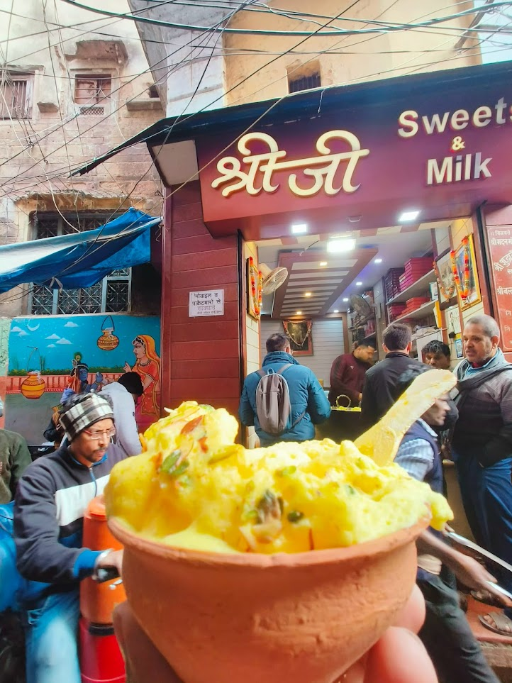
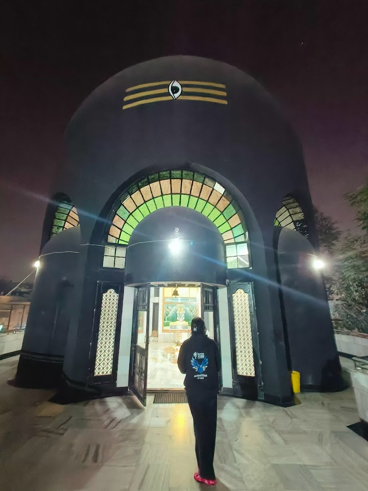
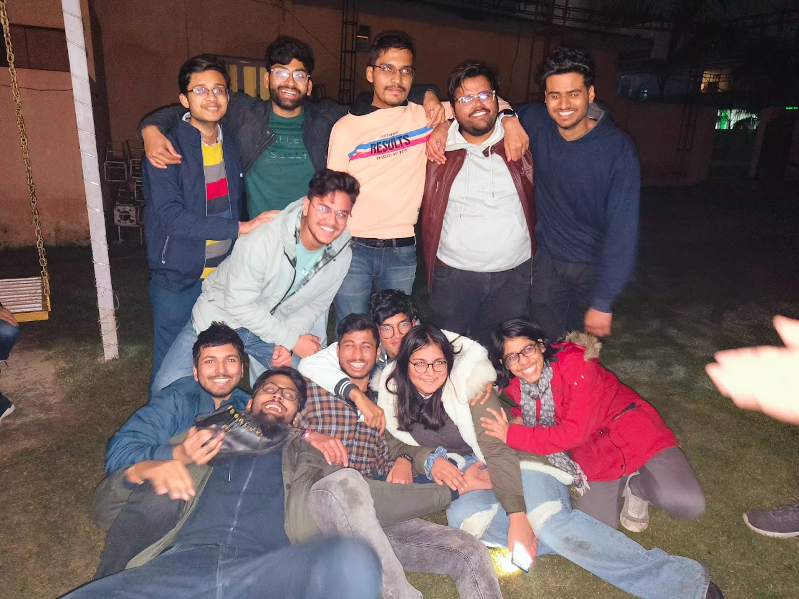

It was time to return back to campus after partially recovering from the tragic happenings of [09/26/2022](https://www.indiatvnews.com/news/india/himachal-pradesh-tempo-traveller-accident-kullu-bus-rolls-down-gorge-death-toll-2022-09-26-811428).

## Detouring from Marudhar

My dad came to drop me over for registration in December. We took the infamous **Marudhar Express** from Jaipur to Varanasi Junction in 2AC oblivious of what was about to unfold. The compartment was **shaking** too much for some reason I couldn't even sleep and my neck started hurting badly. It was just so painful that Papa and I decided to just drop at **Agra Cantt Railway Station** only. First thing, I vomitted then we took a cab to some hotel, I ate something and again vomitted so slept on empty stomach.

Next day we took a Taxi for **Delhi** because it was the nearest Airport. Thankful to Mr. Gadkari for building just amazing **4 lane Agra Delhi Highway** with no bumps at all which was just what I needed at that time. Since, we reached delhi a little early we took a hotel room in Mahipalpur so that I can get some rest after all the sitting as well as eat a little. The **Blu Smart Cab** arrived for us to go till T3 and we flew on to Varanasi.

We were able to find a good enough room in one of the hotels at **Assi Ghat**, the next day I went to my institute partially recovered as I was which was clear from the incidents of past 48hrs.

I called **Anshuman** to come down at **Saraiya Gate** to help me in going till my room. I was overjoyed :sob: to see everyone, we went to my room, Sacchit was yet to arrive. **Mahesh** ~~dalle~~ was there papa requested him to stay in my room for the time I haven't fully recovered, really thankful to him :yellow_heart:

## Revoking the Z

The major task papa came to College was to convince **Vignesh Sir** to revoke my **Z grade** that he had given to me in the 7th semester as I was **bed ridden** and wasn't in college. Do consider the following things before thinking it was valid:
- Sir was **chill about attendance** which he cleared at the start of semester itself, to the extent that even people who had gone for just **1 class** were passed whereas I went to all of them before mid semester.
- I came down in December to give my **Makeup Examination** too. It was easy and I did get most of the questions right.

We went to sir's office like 2-3 times after which Papa told me to stick to my room while he will go to CSE Department. Sir never was in his office and also didn't see the need to meet us, he was always like _"yeah just give the application signed by DOAA in CSE Office", "I can't consider it Lakshya, I don't care what other profs did"_, etc.

These were the points I received from sir for not passing me:
- It was **"well known"** that I wasn't in college due to the accident.
- He was afraid of actions that Administration could have taken aganist him, despite me telling him **every other professor** passed me.
- He wanted a signed letter from **Dean of Academic Affairs** only then he would consider my request.

_Now why can't the DOAA do it, so as per rules "we can only get medical for 7 days after being absent for more than 21 days due to medical condition"._ My father went to meet DOAA Prof. S.B. Dwivedi who said I didn't take permission from them about the trip so they have no reason to help me out. Whereas ADOAA Prof. R.K. Singh said that it would set a precedence for others if my case was considered, so he can only do things verbally.

So nothing happened and I was meant to suffer the perils of a **failed B.Tech.** and join the summer term which completed on 07/22/2023 when I finally received a B.Tech. pass.

I did meet Vignesh Sir myself after Papa left he told me that it could have turned troublesome for either of us and he would be leniant with me in the summer term. I agreed with his concern since he is a new professor and decided to take up the summer term.

## Reunited with Friends and Foes

I am definitely sure that while some people were overjoyed to see me return some weren't they might have even hoped for me to just die but that's just how love and hate works in today's world. **There can be millions who love you for what you are and thousands who hate you just because they don't know your side of story**, I have made by peace with being okay with that but _I definitely wish for those thousands to be on my court someday._

Nevermind ignoring the bads, I focus on my friends who started dropping by my room to meet me and hear the story xD of how things unfolded (will write that soon :wink:), but yeah I was grateful for all of them. Everyone was kind even **RNC sir** :fearful:.

Papa tried his best to set things up he brought me new Kettle, water bottle, heating belt, socket board, **Anant** gave me his blanket for sometime until mine came back from dry clean, Arpit used to stick around my room, for a day me, abhinav and arpit slept in one room too.

When my friends used to drop by my room Papa **sneakily** used to go out and let us talk while I ensured none of them **cursed** too loudly, he also got to meet a lot of my friends he specifically wanted to meet ~~Minnie~~ **Yamini** (will tell you why in some other post), he was also really happy to meet Abhinav because he forcibly took the suitcase from him.

This was all cozy, finally I told Papa let that Z be I will deal with it on my own somehow and will be alright here surrouned by my friends. Papa left on **30th**, he might have had some tears in his eyes leaving his *broken boy* behind but I was ready to start things up again.

>Gotta catch 'em all

## Trying to be Normal

I was starting to go out with my friends finally but with caution since I wasn't up for all the fun normal people could have gone for. Me, **Arjun** and **Bhani** went to **The Garage Kitchen** for Arjun's B'day treat since we had fun playing games and sharing stuff after so long but had to return early as I couldn't sit for longer than 1-2hrs constantly. I also went with them only to have the **last Malaiyo of season.**

Things were looking good I wasn't confident enough to take my bike out for ride yet and it also needed a bit of servicing as for so long it was there standing still 🤧. Me and Nishtha went to **Bankhandi Mahadev** as part of our final year exploration which took a detour after the Himachal ~~accident~~ incident. Anyhow things were looking bright when I went to Satkaar "Family" Restaurant after so long with my Photog family.

Then for sometime it was quiet in college as everyone went to Madras for **Inter IIT Cult Meet** which I dearly wanted to for but since the journey was too long it wasn't possible. Anyhow they brought me the swags from there 🤭.

_That's it for now finally on a lazy weekend I decided to complete this, the next one am gonna write will be about my accident itself I have started telling the story to new people so casually that it's better to jot it down now._
