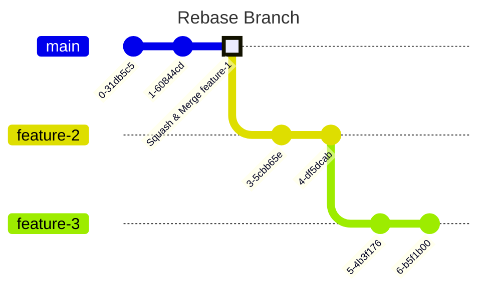

I recently have been working with **stacked PRs** a lot which is a very common pattern if you are working in a *big organisation*. I will share the approach I take to ensure that I face the least *resistance* in terms of the dreaded **merge conflicts** while trying to rebase the stacked branches onto `main` after some of them get merged using a `squash` strategy.

If anything I would add **merge conflict resolution** to the top of my list of things I hate when working on a collaborative project. The primary cause of why merge conflicts occur is:
- someone else made additional change in the same area of a file
- even if the change is same, commits are different which can happen in interactive rebase

So, let's dive into how to deal with the second class of conflicts.

## Stacked PRs
Rather than waiting for review to complete for a single *big* PR you typically fork a branch add a `feature-1` in it and raise a PR to **main**.

Now for the next `feature-2` which requires things in `feature-1` you don't fork off from `main` but `feature-1` itself, add a few commits and then raise a PR to **feature-1**.


This allows for two really nice things:
- faster iterations 🚄 to you without being blocked on reviews
- reviewers are more willing 🕊️ to provide early reviews without procrastination

>[!tip]
>Reviewers also are able to better job if you PR is less than *500* lines so that they can retain full context with them.

## Merging and Rebasing
Now what happens next is your first PR, with `feature-1` will get reviewed and merged into `main` in a squash and merge manner.

Now you will `rebase` `feature-2` on top of `main` and change its PRs base to `main`. And the cycle continues you can further do a `feature-3` on top of `feature-2` now if it wasn't already there.


>[!error]
>Now the issue that happens is we will encounter all the changes that happened in `feature-1` as a merge conflict while rebasing `feature-2` onto `main`.

### Why do conflicts arise?
I was *flabbergasted* to see this happening at first because, if the contents are exactly the same, how can a merge conflict happen?

Evidently it can, because when doing a squash and merge we lost all the commits that were there in `feature-1` after it got merged in `main`. But `feature-2` still has all these commits. 

The conflict is basically asking you which commit do you prefer, the squash one or the original commit even if they have the same content. So now you make use of your shiny editor like **vscode** or **intellij** to resolve them. If you are a *1000x* programmer you might also be using `vim` or [mergetool](https://git-scm.com/docs/git-mergetool)

>[!note]
>After you have rebased your branch on `main` you will still see the commits from `feature-1` in `feature-2` but these are phantom commits. They don't have any content now given the base i.e. `main` already had them.

## How to solve it?
There are multiple ways to do this natively using `git` without making use of external tooling, but for the sake of completeness I will cover both of them.

>[!quote]
>I generally prefer working with things in the purest form without any form of abstraction so that when things start crashing I know exactly what's going wrong under the hood.

### Additional Merge
This is the one which has worked best for me till now.


So here is what happened in the above diagram looking like tributaries of Ganga:
- Squash & Merge `feature-1` into `main`
- Merge `main` into `feature-1`
- Merge `feature-1` into `feature-2`
- Merge `feature-2` into `main`

This is definitely an involved process but it works the best of all in scenarios I have encountered till now.

### Using `onto`
I came across a stackoverflow [answer](https://stackoverflow.com/a/68230162) and blog [post](https://www.putzisan.com/articles/resolving-merge-conflicts-rebasing-stacked-branches) that cover this particular approach which is far more simple.

So instead of using,
```bash
git checkout feature-2
git rebase main
```

We add an additional parameter of `onto`

```bash
git checkout feature-2
git rebase --onto main feature-1
```

By specifying `onto` you instruct git to take commits from `feature-2` that are not in `feature-1` and rebase them on top of `main`.

It need not necessarily be a branch name its `commitish`, so we can give a commit hash. It would then rebase commits after that particular commit on top of the `main`.
```bash
git checkout feature-2
git rebase --onto main <COMMIT_HEAD_FEATURE_1>
```
~~Why didn't I talk about this first? Well because I tried it and in some complex cases it failed to provide good results.~~

>[!success]
>I have been trying this now and it actually works very well for rebasing stacked PRs. The only caveat is if you change commit of a base branch you need to resolve merge conflict, new commits work fine.

## Bonus Treat
This is a tool which was recommended to me in the onboarding docs of my organisation ~~but I didn't~~. [Git Town](https://www.git-town.com/) is an abstraction on top of `git` by wrapping a lot of our workflows into commands.

Things like [sync](https://www.git-town.com/commands/sync.html), [hack](https://www.git-town.com/commands/hack.html), etc. are pretty good for handling basic workflow. It has a separate section on dealing with [stashed changes](https://www.git-town.com/stacked-changes.html) which should cover and handle things for us.

It makes use of the [using additional parameters](#using-additional-parameters) strategy as described in this [issue](https://github.com/git-town/git-town/issues/4189).

Git town seems pretty cool TBH and can reduce a lot of time for me in doing these things myself. I might just give it a try 😉, also because the creator [Kevin Goslar](https://github.com/kevgo) seems like a pretty cool guy ~~do stalk him~~.

>[!warning]
>I tried making use of git town for sometime and while the tool handles commands that am planning to perform, it does a lot of additional work to be safe like fetching from remote and rebasing everything again which takes time that I find hard to bear.

## Conclusion
Thanks for reading through, I hope this helps you in the organisation that you are working in to *save some time* and use it for coding using whatever new shiny LLM is in the market right now.

I haven't been up with blogging because I am currently in a phase of change, transitioning into a new job and new place. It's difficult to get out of your comfort space to face new challenges but its even more sad to always be stuck in the same place. So just as always I am chasing that new adventure and journey.


See you in the next blog till then you know where to [find me](https://twitter.com/1108king).
