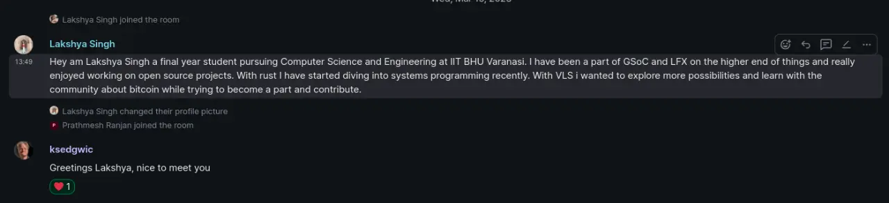
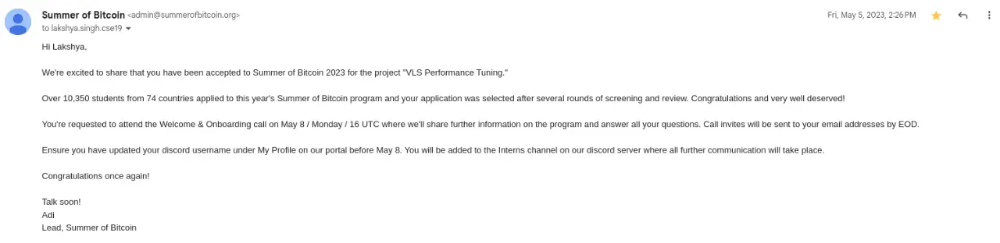

I had previously completed [Google Summer of Code | 2021](https://king-11.github.io/blog/posts/gsoc-report/) and [Linux Foundation Mentorship | 2021](https://king-11.github.io/blog/posts/lfx-report/) two highly renowned open source programs which paved my path towards excellence as a software developer. I chose open source for reasons I have highlighted in [Collaboration not Competition](https://king-11.github.io/blog/posts/collab-to-top/) but it brought so many other good things along with it like **learning**, **friends**, **experience**, **connections**, etc.

There was one space which was left for me to explore with open source, **Bitcoin**. Summer of Bitcoin started when I did my **GSoC** and the next summer (2022) again I didn't apply because I was focused on my internship at **Microsoft** to grab that **P.P.O.** and chill for final year.

I was by no chance a bitcoin **supporter** I had heard news about **bubble** crash, people losing so much **money** including my own maternal uncle, the **energy** consumption for mining activities and then the associated **latency** of transactions. The idea seemed innovative but **not** at all **practical** to me.


I even jotted my thoughts and posted on whatsapp status. Two people (**Nishant Kumar** and **Aditya Sharma**) I vividly remember came to help me understand Bitcoin better and work towards getting a better understanding of its internals before making random claims. So that's what I aimed to do with summer of bitcoin grab **understanding** of bitcoin better and completing the **holy grail of open source programs** before ending my college journey.

# Application Process
I went ahead and applied on [website](https://www.summerofbitcoin.org/) for summer 2023 very **late** as I was engaged with **Inter IIT Tech 11.0**. Before getting entry on the discord server for proposal round we had to complete two bitcoin courses by [saylor](https://learn.saylor.org/course/PRDV151) this included going through all the content and then giving a final exam. With whatever minimal understanding I had and internet resources, I gave the test after it was done I was on the SOB discord server.

## Project Selection
With my new found love for rust I wanted to apply into a project which was written in rust. To my surprise **rust** was amongst the **predominant** technology being used in bitcoin which speaks a lot about the intent to make sure bitcoin and its associated projects are **secure software** to use.

While most projects were already flooded with applicants [VLS](https://vls.tech) caught my eye as there weren't many people engaged so I went with it. I was welcomed by **Ken** who is such a humble individual with so much knowledge and experience.



## Competency Test
Every project in the organisation had an associated competency test. We had to build the software and like every new software I couldn't at first. It's generally because I use bleeding edge linux like **fedora** and **manjaro** (in past) while it takes sometime for packages to catch upto them.
```bash
make build-experimental
# error: not a problem with poetry but with grpcio (1.47.0)
# latest gcc wasn't yet ready to work with grpcio
```

I didn't want to setup a virtual machine as they are very slow. Also I didn't want to shift to ubuntu whose operations were working fine. So I created a **ubuntu container** and tried running vls tests inside it. I encountered some errors related to lowdown which ken helped me resolve.

Again I couldn't do this because containers don't support **systemd**.

flowchart LR
	s[systemd]
	sn[snapd]
	btc[bitcoind]
	s --> sn
	sn --> btc


I think I tried **WSL** but systemd isn't directly supported there as well. I was only able to make VLS work on WSL later around August and documented my journey with WSL in a [github issue](https://github.com/king-11/dotrc/issues/3)

Finally I made some space and **triple booted** my beast of a laptop. So I had **Ubuntu 22**, **Fedora 35** and **Windows 10** on the same device now. Finally I completed competency test which was to find the time taken by some of the operations by wrapping function calls in `Instant::now()` and `elapsed()` on certain tests.
```bash
Time elapsed in sign_counterparty_commitment_tx_phase2() is: 1.430216ms
Time elapsed in validate_commitment_tx() is: 30.734µs
```

## Proposal
There was only one project for VLS. The bench-marking one:
>The project aims to benchmark and improve the performance of the Validating
Lightning Signer.

I clarified on the expectations of project from ken and devrandom:
1. **Identifying** main operations for benchmarking
2. **Benchmarking** the main operations of a node running against the VLS
3. Identifying **bottlenecks** causing latency for different configurations
4. **Updating** the code base to handle those bottlenecks

I covered details about two options for creating bench-marking tests `criterion` and `test`. Listed down ways we can do **optimisation algorithmic, config, inlining functions,** etc. During phase of proposal submission I started helping other beginner contributors as much as I can while trying to understand the project.

### Last Minute Submission
I **delayed** the whole writing of proposal till very late. I don't remember why I did it but it was probably because it was my **final semester** in college and I wanted to leave no stone un-turned explore everything, hangout with friends, work for council and clubs, etc.

The deadline for submission was **16th April, 7:30AM** and I began writing my proposal after coming from Shubhanshu and Yamini's birthday party on **15th April** at **11:50PM**. I somehow kept myself awake through the process of writing proposal and submitted the proposal. With no expectation of getting selected or not I was at peace.

## Selection
Jack contacted me while they were checking my application to know about when do I start with Microsoft. I misread and talked about my internship experience instead, he told me they had submitted results and Adi will reach out to us.



# Summer of Bitcoin
I had the onboarding call with **ken**, **devrandom** and **jack**. There was one more fellow intern with me dhruv. The team liked both of our applications and hence decided to increase the slots and create one more project for memory usage bench-marking as well. I took the time latency and dhruv memory.

The team got us to buy `STM32F413H` devices which would come in handy for our projects.

## Merge Requets
>"Talk is cheap. Show me the code." - Linus Torvalds

|                     Title                     | Link                                                                                 | Type           |
| :-------------------------------------------: | ------------------------------------------------------------------------------------ | -------------- |
|          cln testnet service (!431)           | https://gitlab.com/lightning-signer/validating-lightning-signer/-/merge_requests/442 | DOC \| FIX     |
|         add gawk for one-time (!442)          | https://gitlab.com/lightning-signer/validating-lightning-signer/-/merge_requests/442 | DOC \| FIX     |
|        dont print error on help (!444)        | https://gitlab.com/lightning-signer/validating-lightning-signer/-/merge_requests/444 | FEATURE \| FIX |
| transaction operations benchmark tests (!487) | https://gitlab.com/lightning-signer/validating-lightning-signer/-/merge_requests/487 | TEST           |
|              fedora setup (!474)              | https://gitlab.com/lightning-signer/validating-lightning-signer/-/merge_requests/474 | DOC \| FEATURE |
|            persister bench (!492)             | https://gitlab.com/lightning-signer/validating-lightning-signer/-/merge_requests/492 | TEST           |
|    update nightly vls-signer-stm32 (!507)     | https://gitlab.com/lightning-signer/validating-lightning-signer/-/merge_requests/507 | DOC \| FIX     |
|          bench crypto ops stm (!508)          | https://gitlab.com/lightning-signer/validating-lightning-signer/-/merge_requests/508 | TEST           |

## Documentation

**Documentation**: Apart from this I worked towards fixing documentation which is the first part any developer encounters making it easy so that others don't face the issues I did. There were changes in packages, nightly version to use for STM and minor things.

**Fedora Setup**: The first thing I did as part of project was to make life easier by working out details on how to make vls work again on fedora linux. I added the details for the same into our updated documentation.


## Operation Latency
We started with our decided plans of first doing the operations (keysend, pay, etc.) and checking their latency with multiple configurations of device (socket server/stm32) and logging modes (debug/info).

Below is the flow when any operations happen on a lightning node with VLS.


sequenceDiagram
	participant SignerA
	participant NodeA
	participant NodeB
	participant SignerB

	activate NodeA
	NodeA->>+SignerA: SignCounterpartyCommitment(m+1)
	SignerA-->>-NodeA: ack

	NodeA->>+NodeB: commitment_signed(m+1)

	NodeB->>+SignerB: ValidateHolderCommitment(m+1)
	SignerB-->>-NodeB: ack

	NodeB->>+SignerB: RevokeHolderCommitment(m)
	SignerB-->>-NodeB: ack

	NodeB->>-NodeA: revoke_and_ack(m)

	NodeA->>+SignerA: ValidateCounterpartyRevocation(m)
	SignerA-->>-NodeA: ack

	deactivate NodeA


For running the operations using **socket server** I had setup a testnet node on my laptop which was connected to ken's node. I had to manually go through the **logs** and ask ken to provide me the same using which I created **diagrams** with time for each operation.

Like a regular programmer who denies any form of **manual labour** I tried automating the task and making my life a little easier using **scripts** which used to:
- copy the vls log file and then truncate it to `0`
- do the operation of keysend and pay
- wait for sometime after the operation is done
- copy the log file again into current directory.

This helped reduce the manual labour somewhat by getting logs for precisely the time of operation.

I also did the [operations](https://gitlab.com/lightning-signer/validating-lightning-signer/uploads/0b70cff01d6e364213a57a7ea3b5b0e9/signer-info.png) for STM but instead of doing them with an external node I utilised the **system tests** which create temporary nodes on the same system.

## Benchmarking Tests
After we had done these operations for sufficient time and were happy with the results. I started working on writing benchmark our three major operations.
- Sign Remote Commitment
- Validate Holder Commitment
- Validate Revocation


I also added in benchmarks for our `secp256k1` since we have a lot of activities using its functions. Finally we had a good overview on our operation latency.
```bash
7609 bench INFO - Bench: Sign ECDSA, 200 iterations in 3360ms, each 16.8ms
12941 bench INFO - Bench: Verify ECDSA, 200 iterations in 3521ms, each 17.605ms
12966 bench INFO - Bench: SHA256, 200 iterations in 16ms, each 0.08ms
17941 bench INFO - Bench: Secp256k1 Create, 200 iterations in 3316ms, each 16.58ms
```

### Sled Issue
During the testing `devrandom` found it odd that even on a rotating disk the performance tests for persister were running really fast. Going further it was realised that it was issue of our key-value store `sled`. It was not have been syncing to disk correctly.

Sled uses `sync_file_range` for flushes, which does not guarantee durable writes, except on specialised hardware (e.g. battery backed-up HD cache). Hence, we decided to move away from `sled` to `redb`.

# Takeaways
The biggest key thing for me was I understood **bitcoin** why it was **created**, how will it go **further** and what will take it go further. I poured all my understanding into this blog [Bitcoin, the Financial System](https://king-11.github.io/blog/posts/bitcoin-financial-system/).

Along the way I got to interact with highly skilled and amazing mentors **Ken** and **Devrandom**. By reviewing my MRs and having **discussion** with me around them they helped me get a better perspective on **software development, testing, security** etc.

I have continued contributing to **VLS** even became one of the **core contributors** with **ownership** of the [VLS Container](https://gitlab.com/lightning-signer/vls-container) project. I have been invited to [bitcoin++ austin!](https://btcplusplus.dev/conf/atx24) as a **speaker**, I am finding it hard to get a **US Visa** but hopefully I might get a chance to visit there, if you know someone who can help please do reach out to me.


Thanks for reading like always I am starting to get back in the routine of writing one blog per week hoping to write more and learn more.
