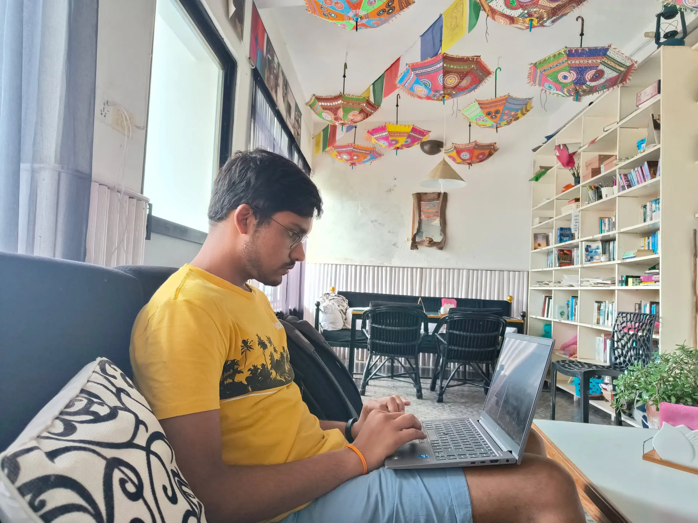
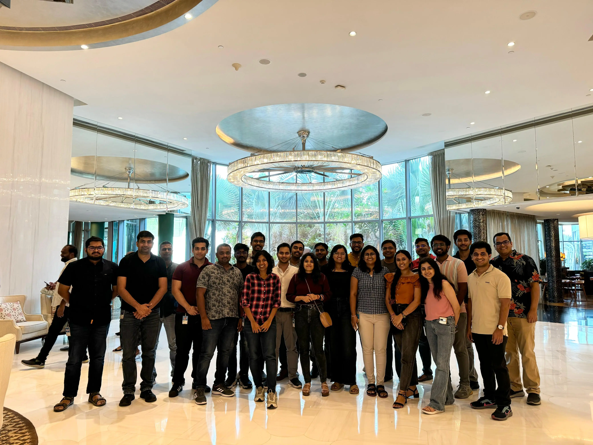

I know it's a very *clickbait* title but this is something that I have been asked multiple times. Why would I choose a startup over working in one of the most prestigious companies in the world?

The answer to choosing a company isn't simple if you are in the tech world for passion and not just for money. I will try to cover what my reasons were, what was working right and what wasn't in this blog which might help others in a similar position to make a more judicious decision.

But first, let's step back a little and find the origins of my journey.

## Summer Child
My journey began in the summer of 2021, when I landed an online internship at Microsoft-thanks to COVID, my “first day” was virtual, but that didn’t dampen my excitement. I was so eager, I even visited the Noida office just to see it from the outside.

Getting a full-time offer was a huge relief, especially since the PPO rate had dropped to *50%*. I still remember reading that email on my way to see my grandparents and immediately sharing the news with my family and friends-no more DSA grind!

I’d hoped for an interview with Microsoft Redmond, but they didn’t visit our campus that year, and after my **accident**, I wasn’t in shape for interviews anyway.

July 2023 marked my first official day as a full-time employee. My manager, Phani Chiruvolu (now a mentor and friend), told me I’d soon be moving to a new team and encouraged me to just focus on learning for now. Three weeks later, I joined Team MARIO under Jatin, ready for a new chapter.

People often ask me about the work and environment at Microsoft. Was it everything I hoped for? Let’s break it down.

## Team MARIO
My team in Azure Core Compute was truly special-lively, supportive, and nurturing, thanks to leaders like VP Charu, my managers Arindam and Jatin, and our lead Deep. The environment was perfect for young developers to grow.

I was taught by my manager that overtime is only required when we don't plan well and are not working productively in the time we are working, so that's all that was expected of me and rest of time is mine.

Flexibility was unmatched, I could work from anywhere-be it with family, in the Himalayas, or at the Hyderabad office. As long as the work moved forward, I had total freedom.

I had full freedom to pursue new ideas, which were engineering improvement that weren't back logged due to product requirements:
- I introduced protobuf for contract generation, streamlining our multi-language workflows.
- Led the observability upgrade with distributed tracing via OpenTelemetry, giving us deep system visibility.
- Improved team documentation, turning scattered tribal knowledge into accessible resources.

There was a also a really active learning culture, we had v-team to make everyone pursue learning actively. Every month on Learning day everyone used to take the day out and try new technologies, read some engineering papers, etc which we couldn't do everyday.

In terms of responsibility, we had full ownership of our product. Our team managed everything-coding, deployment, resource management, and monitoring. We truly owned our product end-to-end.

And beyond the work, the personal bonds within the team made every day enjoyable.

### People
I went to the office every day simply because I genuinely enjoyed being around my teammates. There was always something happening-weekend house parties, café outings, bowling, or badminton. Even on rough days, my teammates knew how to lift my spirits.

The connections I made, both through work and random meetups, are still a big part of my life. My mentors and peers created an environment where I could push myself professionally while still having a life outside of work.

One of my favorite team rules was “no work talk at lunch,” which led to some hilarious and surprisingly deep conversations. I even picked up a gym habit with a few teammates-what started as a group challenge quickly became a routine I looked forward to.

## So why change?
I was growing in my career, learning new things, had supportive managers, a great team, and lived in ~~my favourite~~ a city I enjoyed. So why consider leaving?

My initial plan was to switch companies after two years, but as interview opportunities arose, I began preparing in earnest.

Luckily, both the two interviews I gave both turned into offers and I was left with a big question: Should I move? the answer was a big yes, specifically for Glean, where I joined a lot of things were what I wanted:
- I wanted to be in a company that has a lot of smart people because you are average of the people you hang out with
- I wanted to work on a product that people enjoy using because its a joy to tell someone who think my product is pretty great that "I built that"
- I wanted to experience the startup culture but also not take a lot of risk so a mid stage startup was the right fit to be in that pace of work
- I wanted to build wealth, fast-track my retirement and not just earn money. This comes in form of ESOPs at a growing company

While I had my own reasons for wanting a change, my decision only became clear after I received new job offers. Before that, there were a few issues at Microsoft that bothered me, but none were serious enough to make me anxious or want to leave in a hurry. These included:
- **Low compensation:** Microsoft’s pay is quite low compared to tech industry standards. For the level of impact I was delivering, I didn’t feel I was being compensated fairly.
- **Uncertain career progression:** Advancing to the next level at Microsoft can be unpredictable. I was fortunate to get promoted in my first year and was on track for SDE2 within two years. Still, there was always anxiety-what if I didn’t make it, as happened to many others?

Another thing I noticed was that, in such a big corporation, there are inevitably some _“dead weights”_ who aren’t very motivated to grow or learn. Occasionally, I found it frustrating to be compared with others simply because we worked at the same company, even though our attitudes and contributions were quite different.

## Risks with a startup
If you think about this one question you will understand the biggest risk involved in joining a startup. _"How many startups actually see the light of the day?"_ very few actually. Not all of them go on to become large scale corporations which is what you hope for at the end of the day.

At the end you want your ESOPs to convert into real money and wealth that fulfills the dream you were shown. Otherwise if the startup dissolves that wealth is just lost, you don't lose on your reputation as an individual of course the learnings, knowledge and relations you built will stay with you.

There is another major risk, what kind of culture are you getting yourself into? Some startups like Zomato, Navi, etc have pretty toxic culture where being **forced** into working overtime, finding it difficult to find time for *your own life*, micro management, etc are pretty common.

 >[!quote] You have two lives, and the second one begins when you realize you only have one.

Most of the startups don't provide you great flexibility in working from anyplace you want to and many big corporations too like Amazon, Flipkart, etc. now. I myself prefer going office everyday but certainly there are times when I want to be with my parents, when they are healthy and lively because they are getting old and have crossed `50`. Obviously I will be there when they are ill but _isn't that too late_?

If you compare these things with big corporations things like ESOPs for RSUs, relaxed pace of work, opportunity to choose work life balance and having flexibility in working from anywhere are gonna be there. These ships like Microsoft, Google, Oracle, Apple, Amazon etc are **unsinkable** ships at this point of time.

## Factors to consider
If you are planning your next move think about these things before just saying yes to the biggest pay check:
- What kind of product do you want to work on?
- What is your risk appetite?
- What kind of peers do you want?
- What kind of environment do you want to work in?
- Do you want a more relaxed work pace?
- Do you want to build wealth?
- Do you want to be there for your parents, friends and family more?
- Which city do you want to work from?

>[!warning] You can't have everything there is always gonna be some tradeoff

Think about your tradeoffs I was lucky enough to have most but there were some which couldn't happen for me like:
- I wish I could have stayed in Hyderabad, its the most livable city with some amazing people. I lived 5 mins away from Microsoft office nothing beats that :P
- I wish I had more opportunity to work from home but Glean has a 3 days work from office policy with yearly 2 weeks of WFH allowed.

Every career move comes with its own set of tradeoffs-there’s no perfect choice. For me, leaving Microsoft wasn’t about escaping something *negative*, but about seeking new challenges, faster growth, and a different kind of fulfillment. Whether you value stability, flexibility, rapid learning, or building wealth, the key is to weigh your priorities honestly and make a decision that aligns with your goals and **happiness**

>[!quote] There are no wrong decisions in your career only experiences that help you grow.

I am grateful to have a lot of mentors and friends who helped me in making the choice for myself. In case you read it till the end and still have questions don't hesitate to reach out, you know where to [find me](https://twitter.com/1108king).
